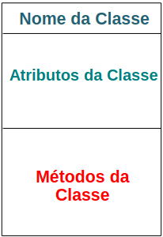

### Requisitos

Uma condição ou capacidade necessária para um usuário resolver um problema ou alcançar um objetivo.

#### Requisitos Funcionais

**O que o sistema faz**

Diretamente ligados a funcionalidade do software, descrevem as funções que o software deve executar.
Descreve uma interação entre o sistema e seu ambiente.
Ex: "O sistema deve prover um formulário de relatório como os resultados dos testes clínicos de um paciente"
    "Permitir a criação, edição e exclusão de documentos de forma colaborativa entre os técnicos"
    "Manter histórico de versões dos documentos, registrando os técnicos que fizeram as alterações"

#### Requisitos Não-Funcionais

**Como o sistema se comporta e quais qualidades ele deve ter**

Expressam condições que o software deve atender ou qualidade específicas que o software deve ter.
Em vez de informar o que o sistema fará, os requisitos não-funcionais colocam restrições no sistema.
    Ex: "As consultas ao sistema devem ser respondidas em menos de três segundos"
Devem ser mensuráveis. Deve-se associar forma de medida/referência a cada requisito não-funcional elicitado.

# Ideia: Mapa da Faculdade

### Análise de Sistemas Similares (Benchmarking) 

https://maps.google.com (Google Maps)
https://campusmap.ufpr.br/dev/github/UCM-SitePrincipal/ (Campus Map)
https://moovitapp.com/pt-br (Moovit)

## Especificação de Requisitos

É a descrição sistemática e abstrata **do que o software deve fazer** a partir daquilo que foi analisado anteriormente.
Apresenta a **solução** de como os problemas levantados na análise devem ser resolvidos pelo software em desenvolvimento.
É a **forma de comunicação** direta entre o analista e a equipe de desenvolvimento de software.
Especificar um requisito implica em **compreender exatamente o que deve ser feito e que se espera receber como resultado**.
Existem diferentes tipo de especificação ao longo do desenvolvimento e em vários níveis.
* Cenários
* Requisitos (com maior nível de detalhes)
* User Story
* Casos de uso
* Protótipos

---

## Diagrama de Atividade

**Conceito**:
* Utilizado para modelar atividades.
* Podem ser vistos como uma extensão dos fluxogramas.

**Utéis para**:
* Modelar um processo de negócio.
* Especificar operações.
* Especificar algoritmos complexos.
* Especificar métodos.
* Contém todas as construções lógicas encontradas na maioria das linguagens de programação, o que facilita a sua tradução para pseudo-código ou mesmo em código nativo. 

Alguns analistas utilizam o diagrama de atividades para modelar Casos de Uso, porém:
* A notação dificulta a leitura dos casos pelos *stakeholders*.
* Pequenas alterações no texto podem se tornar bem mais trabalhosas no diagrama.
* Os diagramas ocupam, geralmente, um grande espaço, trazendo problemas para a impressão dos mesmos.

### Elementos do Diagr. de Ativ.

**Atividade inicial**: ponto inicial do fluxo

**Atividade**: representada por um retângulo de cantos arredondados com nome da atividade no interior.

**Transição**: representa o fluxo de execução entre duas atividades.

**Condição de guarda**: associada a uma transição que determina se aquele fluxo de execução pode ser seguido ou não, definida entre [ ]. Equivale *if*.

**Decisão**: representa ponto onde uma decisão deve ser tomada. As alternativas são definidas por condições de guarda entre [ ]. Equivale *if else*.

**Ponto de merge**: representa local onde dois caminhos alternativos se juntam. <u>Cuidado</u>: Diferente de sincronização.

**Concorrência**: alguma atividades podem acontecer simultaneamente ou em paralelo, para isso usamos o símbolo de bifurcação e sincronização.

**Sinal**: representa uma mensagem enviada ou recebida.

**Atividade final**: representa o fim do fluxo de execução. Pode existir mais de uma.

**Swinlanes (rais de natação)**: permitem determinar as responsabilidades na execução de cada ativdade.

---

## Diagrama de Classes

##### Classe
Representa um **grupo de objetos / categoria**, que tem as mesmas características e comportamentos.

##### Atributo / Propriedade
Representa **características** de uma classe.

Localizando classes e atributos:
* A partir dos Requisitos/Casos de Uso, extrair **substantivos**.

##### Método
Representa uma **atividade** que o objeto de uma classe **pode executar**.

Localizando comportamentos/métodos:
* A partir dos Requisitos/Casos de Uso, extrair **verbos**.

### Diagrama de Classes UML
* Mostra a **estrutura estática das classes** de um sistema.
* Composto pelas classes (com seus atributos e métodos) e pelo relacionamento entre elas (associação, agregação, composição, generalização/especialização).

### Classe

Visibilidade de atributos (nível de acessibilidade):
**\-** private (privado): somente objetos da classe detentora do atributos podem exerga-ló.
**#** protected (protegido): além dos objetos da classe detentora, os objetos de sua subclasse podem ter acesso.
**+** público (public): o atributo pode ser utilizado por qualquer objeto.
**~** package (do pacote): visível por qualquer objeto dentro do pacote.

* Obs: geralmente atributos são privados ou protegidos.

### Tipos de Relacionamentos

#### Associação

* Representa um relacionamento entre objetos de duas ou mais classes.
* Representada por uma linha conectando as classes associadas.
* O significado de uma associação é **nomeado** (geralmente um verbo ou uma frase verbalizada).
* Uma classe pode estar associada a ela mesma, chamada de associação unária, reflexiva ou auto-relacionamento.

| associação entre duas classes | associação unária | 
| --- | --- |
| | |

**Multiplicidade**: é o **número de instâncias** de uma classe relacionada com instância de outra classe. Para cada associação, há uma **multiplicidade em cada direção**.

| | |
|---|---|
Muitos         | *
Apenas um      | 1
Zero ou muitos | 0..*
Um ou muitos   | 1..*
Zero ou um     | 0..1
Intervalo especificado | 2..3 ou 3,5,7

* Obs: quando não há multiplicidade em um dos lados da associação, entende-se que é 1.

**Navegabilidade**: define se é possível, a partir de uma extremidade da associação, chegar a outra extremidade. Determina o **sentido que os métodos poderão ser disparados**.
|||
|---|---|
Bidirecional | <--->
Unidirecional| --->
Indefinido   | ---

* Obs: Podem existir múltiplos relacionamentos entre objetos das mesmas classes.

#### Agregação

* Forma especializada de associação na qual **um todo é relacionado com suas partes** (relacionamento "todo-parte").
* Informações de um objeto-todo **são complementadas** pelas informações contidas em um ou mais objetos-parte.
* A classe objeto-parte é vista como um "atributo" da classe objeto-todo.
* Lido como "é parte de".
* Representado por uma linha de associação com um diamante vazado junto à classe agregadora (objeto-todo).
* Contém multiplicidade.

#### Composição

* Tipo mais forte de relacionamento "todo-parte".
* Demonstra que **os objetos-parte têm de estar associados a um único objeto-todo**.
* A classe "parte" **não tem existência independente** da classe "todo".
* É representado com uma linha de associação com um diamante preenchido.

#### Generalização/Especialização

* É uma hierarquia de abstrações na qual uma subclasse (classe-filha) **herda a estrutura de dados e comportamentos** de uma ou mais superclasses (classe-mãe).
* Lida como "é um tipo de".

* **Herança simples** é quando uma subclasse herda de uma única superclasse.
* **Herança múltipla** é quando uma classe herda de mais de uma superclasse.

