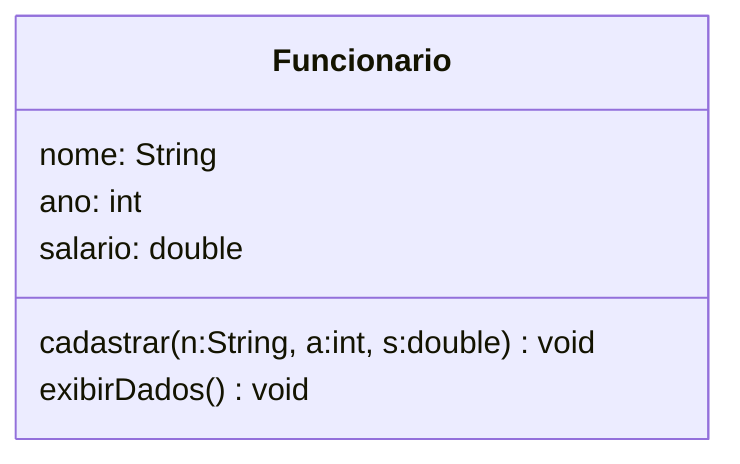
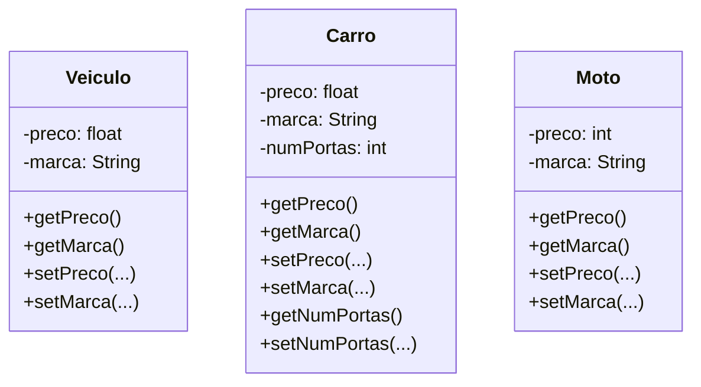
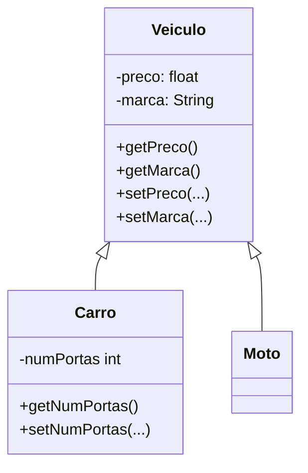
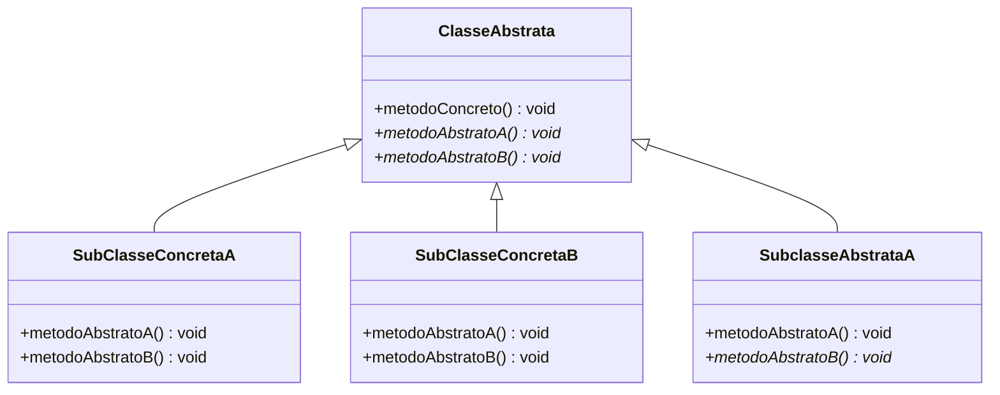
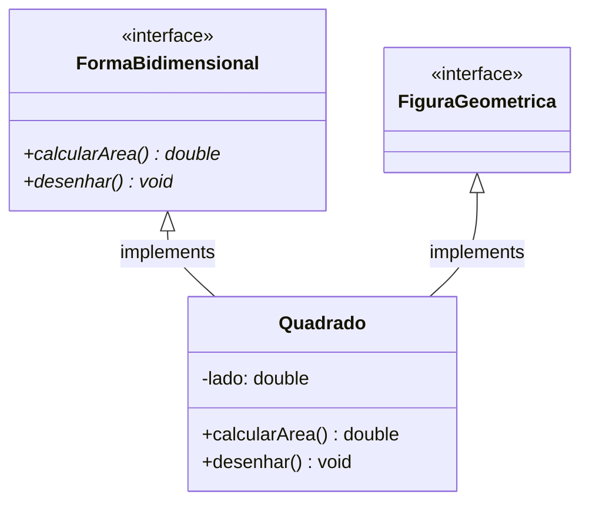
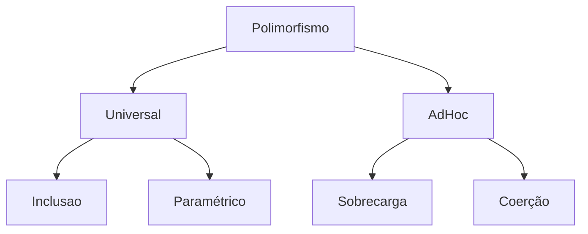
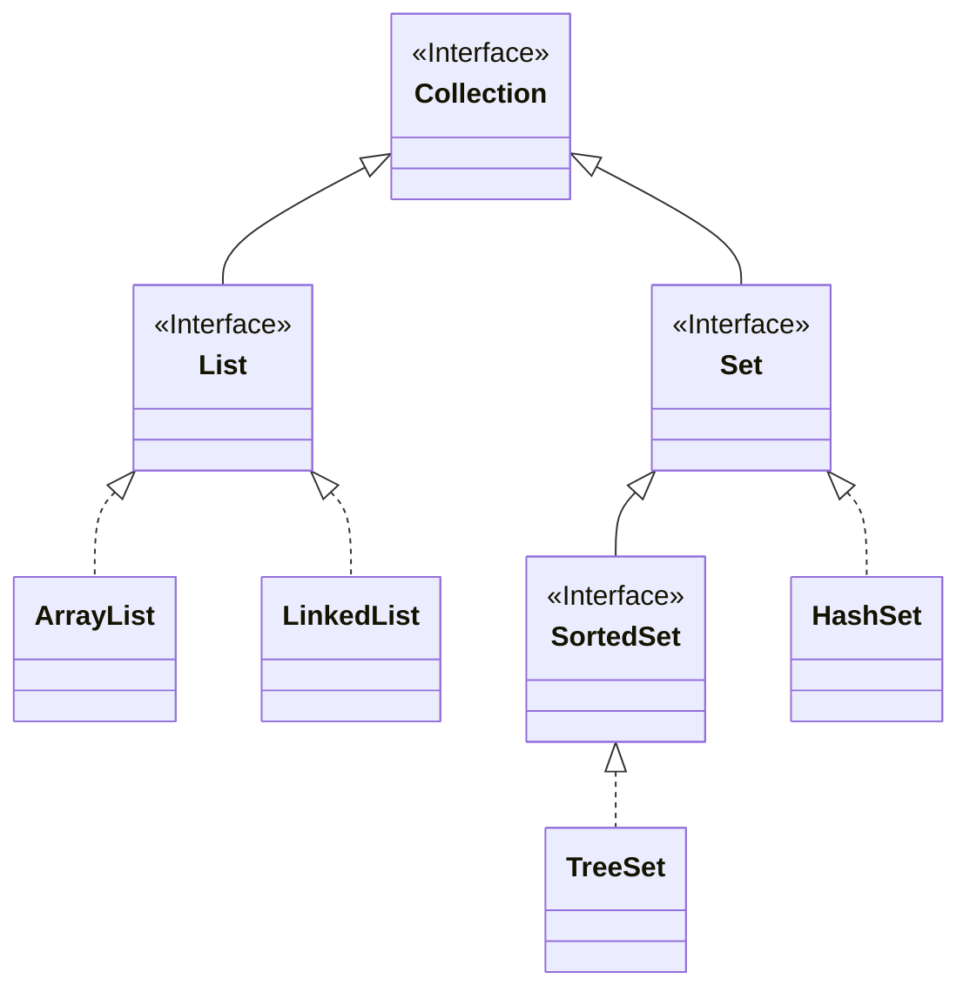
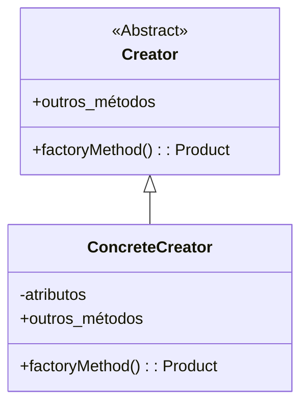

# Paradigmas de Programação

## Sumário

1. [Introdução a Linguagem Java](#introdução-a-linguagem-java)
2. [Linguagem e Paradigma de Programação](#linguagem-e-paradigma-de-programação)
3. [Classe e Objeto](#classe-e-objeto)
4. [Arrays em Java](#arrays-em-java)
5. [Classe String em Java](#classe-string-em-java)
6. [Encapsulamento](#encapsulamento)
7. [Construtores](#construtores)
8. [Atributos do tipo Classe](#atributos-do-tipo-classe)
9. [Herança](#herança)
10. [Sobrecarga](#sobrecarga)
11. [Classe Abstrata](#classe-abstrata)
12. [Interface](#interface)
13. [Polimorfismo](#polimorfismo)
14. [Coleções](#coleções)
15. [Padrão de Projeto](#padrão-de-projeto)
---
16. [Introdução ao Haskell](#introdução-ao-haskell)
17. [Condicionais e Recursão](#condicionais-e-recursão)
18. [Lista e Tupla](#lista-e-tupla)
19. [Casamento de Padrões](#casamento-de-padrões)

# Java

## Introdução a Linguagem Java

* Orientada a objetos
* Gerenciamento automático de memória
* Portabilidade
* Composto por dois ambientes:
    * JDK (Java Development Kit) - Ambiente de Desenvolvimento:
    * JRE (Java Runtime Environment) - Ambiente de Execução: Consiste na JVM e na Java API
        * javac - compilador
        * jar - empacotador
        * javadoc - ferramenta para geração de documentação
        * JVM (JAVA Virtual Machine): Máquina virtual que interpreta e executa o código java compilado.

O código fonte é o **BemVindo.java** e após a compilação usando `javac` irá gerar o cexecutavel **BemVindo.class**, e para executar use `java BemVindo`.

### Classes

Todo programa consiste de pelo menos uma declaração de classe.

```java
public class BemVindo {
    ...
}
```
A palavra class introduz uma classe.

Programa Principal: Método main()

```java
public class BemVindo {
    public static void main(String[] args) {
        // Método principal
        System.out.println("Olá, seja bem-vindo!");
    }
}
```

### Entrada e Saída

```java
import java.util.Scanner;

public class Principal {
    public static void main(String[] args)
    {
        Scanner input = new Scanner(System.in); // Faz a instância do Scanner
        int num;
        System.out.print("Digite um número: ");
        
        num = input.nextInt;

        System.out.println("Número digitado: " + num);

        input.close();
    }
}
```

### Tipos de Dados
* lógico: boolean
* textual: char e String
* ponto flutuante: float ou double
* inteiro: byte (8 bits), short (16 bits), int (32 bits) e long (64 bits)

Váriavel final: váriavel não modificável, constante.  
`final String msg = "Bem vindo!";`

## Linguagem e Paradigma de Programação

Uma linguagem é composta por dois conjuntos de regras para definir programas:  
ex:
```java
if (x > 0)
    x = x + 1
```  

* Sintaxe: representação simbólica; `if (<expr>) <instrução>`
* Semântica: conceito que ela representa; se o valor da expressão for verdadeiro, a variável x é incrementada em 1

### Tipos de Paradigmas

#### Imperativo
Instruções passadas devem especificar o passo a passo das ações que serão executadas. Fortran, Pascal, Cobol, C

#### Estruturado
Também conhecido como procedural, capacidade de modularização (métodos, funções, rotinas). As instruções podem ser formadas por umas das seguintes estruturas: sequência, condicionais, repetição.

#### Orientado a Objetos
Organização do código por objetos que contém dados, estados próprios e métodos que alteram e recuperam os dados/estados. Os objetos comunicam entre si para compor a lógica do programa. Java, C++, Simula, Smaltalk, C#

#### Declarativo
Fluxo lógico implícito. Linguagens de alto nível que permite ao programador dizer apenas o que deseja. SQL

#### Lógico
Especifica-se apenas fatos e regras de inferência. Retorno escrito em forma de pergunta.

#### Funcional 
Descreve a computação como uma expressão a ser avaliada. A principal forma de estruturar o programa é pela definição e aplicação de funções.

> Na prática, muitas linguagem são ***multiparadigmas***.

## Classe e Objeto

Uma classe representa um grupo de objetos com características (atributos) e comportamentos (métodos) semelhantes.

```java
public class <NomeDaClasse>{
    // Atributos
    // Métodos
}
```

Conveção:
* Inicial em maiúsculo
* CamelCase (ex: **SampleClassName**)

### Atributos
`<modif_acesso> <tipo> <identificador>;`

#### Modificador de acesso

1. **public** (público): visível a todas classes
1. **private** (privado): visível somente na classe que está
1. **protected** (protegido): visível na classe que está e na pai

#### Identificador
Nome do atributo, segue as convenções:

* Incial em minúsculo
* camelCase (ex: **ano, anoC, anoDeContrato**)

### Métodos
`<modif_acesso> <tipo_retorno> <identificador>(parâmetros) {};`

* Em geral tem modificador de acesso *public*.  
* Segue as mesmas conveções de nomes que atributos.

```java
public class Funcionario{
    String nome;
    int ano;
    double salario;

    public void exibirdados() {...}
}
```

### Objetos

É a instância de uma classe.

#### Palavra-chave *this*

```java
this.nome = nome;
this.ano = ano;
this.salario = salario;
```

Usada para referenciar um atributo da classe.
* Diferencia uma variável de escopo (parâmetro) de uma variável de classe (atributo).
* Melhora legibilidade do código.

```java
public void exibirDados()
{
    System.out.println("Nome" + this.nome);
    System.out.println("Ano" + this.nome);
    System.out.println("Nome" + this.nome);
}
```

### Representação UML (Unified Modeling Language)  

Define a estrutura das classes de um sistema.



## Arrays em Java

* Um grupo de variáveis que contém valores do mesmo tipo. 
* Arrays são objetos.  
* Para se criar um array se usa a palavra ***new***, especificando o tipo e número de elementos.

#### Array Unidimensional

```java
// Exemplos de criação de array
int[] x;
x = new int[7];

// Não é necessário utilizar new
int[] n = {10, 20, 30, 40};

// Posição dos colchetes não interfere.
int num1[]; int[] num1;
```

#### Array Bidimensional

```java
int [][] m;
m = new int [3][4];

int [][] n = {{1,2}, {3,4}, {5,6}};
```

|  |0 |1 |
|--|--|--|
|0 |1 |2 |
|1 |3 |4 |
|2 |5 |6 |

##### Imprimindo uma matriz

```java
public class Matriz{
    public static void main(String[] args)
    {
        int [][] m = {{1,2}, {3,4}, {5,6}};
        int lin, col;

        for (lin = 0; lin < m.length; lin++)
        {
            for (col = 0; col < m[lin].length; col++)
            {
                System.out.print(m[lin][col] + " ");
            }
            System.out.print("\n");
        }
    }
}
```

* `imprimirDadosMat(m);` Quando é passado um array como parâmetro para uma função, ele é passado **por valor**. O Java não permite escolha de passagem por valor ou por referência.

## Classe String em Java

`String texto = "Seja bem vindo.";`

* São tratados com tipos primitivos, logo não é necessário fazer o import.
* Possui mais de 50 métodos
    * length: calcula o tamanho da string
    ```java
    String frase = "Bom dia amigo!";
    int tam = frase.length();
    System.out.printf("O tamanho da sentença \"%s\" é: %d\n", frases, tam);
    ```
    * equals: Compara se duas strings são iguais ou não
    * compareTo(String s): Compara duas strings em ordem alfabética retornando zero se as strings forem iguais e diferente de zero se forem diferentes
    * compareToIgnoreCase(String s): Compara duas strings em ordem alfabética ignorando maiúsculas e minúsculas.
    * concat(): Concatena duas strings
    * indexOf(): Retorna o índice da primeira ocorrência de um caractere
    * replace(char caractere_antigo, char caractere_novo): Retorna uma nova string substituindo todas as ocorrências do caractere_antigo pelo caractere_novo
    * substring(int inicio, int fim): Retorna uma parte da string original, delimitada pelos índices de início e fim
    * charAt(int pos): Retorna o caractere que está na posição pos da String
    * toLowerCase(): Retorna uma nova string com todas as letras em minúsculo
    * toUpperCase(): Retorna uma nova string com todas letras em maiúsculo
    

## Encapsulamento

Não é preciso conhecer todas as partes de uma classe para entender seu funcionamento.

* Segurança;
* Relação de confiança entre as classes: utilizar um método sem conhecer os detalhes da implementação;

Regra do Encapsulamento: :star: **Nenhum objeto pode acessar os atributos de outro diretamente.** :star:

### Como encapsular:
1. Atributos declarados como **privados**.
```java
public class Carro {
    private char tipo;
}
```

2. Criar métodos get/set para <ins>cada atributo</ins> da classe.
```java
public char getTipo() {
    return this.tipo;
}

// Validações devem ser sempre feitas na função set
public void setTipo(char tipo) {
    if (tipo == 'F' || tipo == 'D')
        this.tipo = tipo;
}
```

##### Classe Encapsulada:

```java
public class <NomeClasse>
{
    // Atributos
    // Métodos get/set
    // Outros métodos
}
```

##### Tipo Boolean

O padrão get/set **não** vale para variáveis boolean. Esses atributos são acessados via *is* e *set*.

```java
public boolean isLigado() {
    return this.ligado;
}
public void setLigado(boolean ligado) {
    this.ligado = ligado;
}
```
##### Método toString()

* Retorna a representação de um objeto em string. Está presente em todas as classes.

```java
// Alterando o método toString
public String toString() 
{
    return String.format("Nome: %s \nAno: %d\nSalario: %f", this.nome, this.ano, this.salario);
}
```

## Construtores

```java
public class <NomeClasse> {
    // Atributos
    // Construtores
    // Métodos get/set
    // Outros métodos
}
```
* Toda classe possui um construtor.
* Uma classe pode ter vários construtores.
* São chamados automaticamente quando instâncias de objetos são criadas por meio da palavra chave **new**.

```java
public class Principal {
    public static main void(String[] args) {
        Funcionario obj1 = new Funcionario();
        Funcionario obj2 = new Funcionario();
    }
}
```

Se nenhum construtor é definido na classe, Java irá definir um construtor **padrão (default)**.

Características do construtor default: 

* Não possui parâmetro.
* Não possui conteúdo.
* Não possui tipo de retorno.
* Possui mesmo nome da classe.
* Possui mesmo modificador de acesso da classe.
* Conteúdo padrão inicializado:
    * boolean: false
    * char: vazio
    * int/ponto flutuante: zero
    * instância de classe: NULL

Construtores são usados para inicializar uma classe com valores específicos.

```java
public Funcionario(String nome, int ano, double salario) {
    this.nome = nome;
    this.ano = ano;
    this.salario = salario;
}
```

## Atributos do tipo Classe

!!! warning
    INCOMPLETO, MELHORAR ESSA PARTE

### Relacionamento de classes na UML

Associação: indica que uma classe depende da outra.
* Associação forte: a classe A possui um ou mais atributos do tipo da classe B
* Multiplicidade 1..1: indica que **apenas um** objeto da classe B se relaciona com objetos da classe A

## Herança

Uma forma de reutilização em que novas classes são criadas, absorvendo membros de uma classe existente e aprimorada com novas características e funcionalidades.

* Uma subclasse **"herda"** atributos e métodos de sua superclasse e os utiliza como se fossem declarados dentro da própria classe.

##### Representação sem herança: 



* Muita repetição de código!

##### Representação com herança: 



* superclasse (pai)   -> Veiculo
* subclasses (filhas) -> Carro e Moto
* Todos os carros e motos são veículos, mas nem todos veículos são carros

#### Como implementar Herança

1. Usar a palavra **extends**
2. Declarar os atributos da superclasse como **protected**
    * Membros protected podem ser acessados por:
        1. membros da própria superclasse
        2. membros das subclasses
        3. membros da classe no mesmo pacote

```java
public class Veiculo {
    protected float preco;
    protected String marca;
    // ...
}

public class Carro extends Veiculo {
    // ...
}

public class Moto extends Veiculo {
    // ...
}
```

##### Tipos de Herança

* Herança Simples: uma classe é derivada de uma única superclasse
* Herança Múltipla: uma classe é derivada de mais de uma superclasse
    * O Java **NÃO** permite herança múltipla

##### Quando utilizar Herança?
* Regra: realizar a pergunta ***"É um?"***
* Ex: 
    * Cavalo *é um* Animal?
    * Alface *é um* Vegetal?
    * Gorgonzola *é um* Queijo?
    * Carro *é um* Veículo?

##### Herança em Java

Em Java todas as classes herdam da classe **Object**, alguns de seus métodos são:

* toString(): retorna a representação de um objeto em String
* equals(Object obj): compara dois Objects retornando true se forem iguais e false caso diferentes
* hashCode(): retorna um código hash (int) para o objeto

!! Construtores **não** são herdados pelas subclasses. !!

Instanciar um objeto da subclasse inicia uma cadeia de chamadas de construtores pais, implicitamente ou explicitamente (via super).

```java
public class Veiculo {
    protected float preco;
    protected String marca;

    public Veiculo(float preco, String marca) {...}
}

public class Carro extends Veiculo {
    private int numPortas;

    public Carro(int numPortas, float preco, String marca) {
        super(preco, marca); // Chamada explicita
    }
}
```
#### Métodos - Herança

1. Sobreposição de método 
    * A classe filha pode fornecer outra implementação para um método herdado, fazendo o **overriding** da classe pai.

    ```java
    public class Pai {
        public void metodoX(int p) {
            ...
        }
    }

    public class Filho extends Pai {
        public void metodoX(int p) {
            // O código metodoX do filho sobrepõe o do pai
        }
    }
    ```
    * Regras:
        * O nome do método, a lista de parâmetros e o tipo de retorno **devem** ser os mesmos.
        * O nível de acesso **não pode** ser mais restrito que o método redefinido.

2. Acesso do método da superclasse usando **super()**
    * Para acessar um método da superclasse que também foi definido na subclasse:
    `super.nomeMetodo(lista de parâmetros);`

    ```java
    public class Pai {
        public void metodoX(int p) {...}
    }

    public class Filho extends Pai {
        public void metodoX(int p) {
            super.metodoX(p);
        }
    }
    ```

##### Notação @Override
Indica que o método da classe filha sobrepões o método da classe pai.
* Vantagens:
    * Se o método filho não substituir o método pai, o código não compila.
    * Torna o código fonte mais legível.

    ```java
    public class Filho extends Pai {
        @Override
        public void metodoX(int p) {
            // ...
        }
    }
    ```
#### Classe Final

Uma classe é declarada como final quando ela não puder ser herdada por nenhuma outra classe.

```java
public final class <NomeClasse> {
    // ...
}
```

Qualquer tentativa de criar subclasses resultará em **erro de compilação**.

## Sobrecarga

Tipos:

* Sobrecarga de construtores
* Sobrecarga de métodos

### Sobrecarga de Construtores

Uma classe pode ter vários construtores sobrecarregados permitindo que objetos dessa classe sejam inicializados de diferentes maneiras, basta fornecer múltiplas declarações de construtor com assinaturas diferentes.

Regras:
* A lista de parâmetros **tem** que mudar;
* O modificador de acesso **pode** mudar.

```java
public class ContaBancaria{
    private String nomeT;
    private double saldo;

    // Construtor 1 - padrão
    public ContaBancaria() {}

    // Construtor 2
    public ContaBancaria(double saldo) {
        this.setSaldo(saldo);
    }

    // Construtor 3
    public ContaBancaria(String nomeT) {
        this.setNomeT(nomeT);
    }

    // Construtor 4
    public ContaBancaria(String nomeT, double saldo) {
        this.setNome(nomeT);
        this.setSaldo(saldo);
    }
}
```

Um construtor pode ser chamado dentro de outro utilizando **this**, que deve vir sempre na primeira linha do construtor. Isso evita repetição de código.

```java
// Construtor 1 - padrão
public ContaBancaria() {}

// Construtor 2
public ContaBancaria(double saldo) {
    this(" ", saldo);
}

// Construtor 3
public ContaBancaria(String nomeT) {
    this(nomeT, 0.0);
}

// Construtor 4
public ContaBancaria(String nomeT, double saldo) {
    this.setNome(nomeT);
    this.setSaldo(saldo);
}
```

### Sobrecarga de Métodos

Capacidade de possuir métodos diferentes com o mesmo nome, mas com parâmetros diferentes.

Regras:
* Nome **tem** que ser o mesmo;
* Lista de parâmetros **tem** que mudar;
* Tipo de retorno **pode** mudar;
* Modificador de acesso **pode** mudar.

```java
public void imprimir(int i) {...}
public void imprimir(float f) {...}
public void imprimir(String s) {...}
```

## Classe Abstrata

É uma superclasse extremamente genérica, que não pode ser instanciada.


* Uma classe abstrata é declarada usando *abstract*;
* Deve ter **zero ou mais** métodos abstratos. (Se contém um método abstrato deve ser declarada como abstrata);
* Pode possuir métodos abstratos e não abstratos.

```java
public abstract class Funcionario{} // Classe abstrata
```

#### Método abstrato

* Um método abstrato também é declarado usando *abstract*.
* **Não** possui implementação, apenas a assinatura do método.

```java
public double calcularSalario() { /* implementação */ }

public abstract double calcularSalario(); // Método abstrato
```
* Atributos e construtores **não** pode ser abstratos.

---

* Uma classe concreta (não abstrata), que estende uma classe abstrata, deve fornecer a implementação dos métodos abstratos.
* A primeira classe concreta que herdar essa hierarquia tem que obrigatoriamente fornecer a implementação dos métodos abstratos herdados.
* Caso a classe que estende outra que tem método abstrato e não a implementa, então ela também deve ser declarada como abstrata.

Exemplo:



```java
public abstract class ClasseAbstrata {
    // Atributos
    // Métodos get e set
    // Outros métodos
    public void metodoConcreto() { /*implementação*/ };
    public abstract void metodoAbstratoA();
    public abstract void metodoAbstratoB();
}

public class SubClasseConcretaA extends ClasseAbstrata {
    // Atributos
    // Métodos get e set
    // Outros métodos
    public void metodoAbstratoA() { /*implementação*/ }
    public void metodoAbstratoB() { /*implementação*/ }
}

public class SubClasseConcretaB extends ClasseAbstrata {
    // Atributos
    // Métodos get e set
    // Outros métodos
    public void metodoAbstratoA() { /*implementação*/ }
    public void metodoAbstratoB() { /*implementação*/ }
}

public abstract class SubClasseAbstrataA extends ClasseAbstrata {
    // Atributos
    // Métodos get e set
    // Outros métodos
    public void metodoAbstratoA() { /*implementação*/ }
    public abstract void metodoAbstratoB();
}
```

## Interface

* São declaradas como *interface*;
* Define um conjunto de métodos, mas não define **como** devem ser implementados;

    ```java
    public abstract double calcularArea();
    public abstract void desenhar();
    ```

* Como a herança múltipla não é permitida em Java, interface serve como opção;



```java
public interface FiguraGeometrica {
    public abstract double calcularArea();
    public abstract void desenhar();
}

public interface FiguraGeometrica {};

public class Quadrado implements FiguraGeometrica{
    private double lado;

    public double calcularArea() { /*implementação*/ }
    public void desenhar() { /*implementação*/ }
}
```

* Não possuem atributos;
* As constantes são implicitamente definidas como public, static e final;

    ```java
        // Todas declarações são equivalentes em uma interface
        double PI = 3.14;
        public double PI = 3.14;
        public static final double PI = 3.14;
    ```
* Não possuem construtor;
* Todos métodos são implicitamente public e abstract;

##### Interface ou Classe Abstrata

Interface é a melhor forma de definir um tipo que permite múltiplas implementações. Uma exceção a essa regra é o caso em que a facilidade de evolução é considerada mais importante que a flexibilidade, nesse caso a classe abstrata se sobressai.

## Polimorfismo

Refere-se a capacidade de diferentes objetos responderem de diferentes maneiras a uma mesma função ou método.

***"polimorfismo = muitas formas"***

### Tipos de Polimorfismo



#### 1. Universal

* Ocorre em tempo de execução.

    ##### 1.1 Inclusão

    * É alcançado através da herança e interface. Permite a uma classe herdar características de outra, possibilitando o uso de uma classe base para referenciar objetos de classe derivadas.
    * Uma variável do tipo da superclasse pode armazenar objetos da subclasse.

    ```mermaid
    classDiagram
    direction TB

    class Animal {
        +emitirSom() void
    }
    <<Abstract>> Animal
    class Cachorro {
        +emitirSom() void
    }
    class Gato {
        +emitirSom() void
    }
    class Pato {
        +emitirSom() void
    }

    Animal <|-- Cachorro
    Animal <|-- Gato
    Animal <|-- Pato
    ```

    ```java
    public abstract class Animal {
        public Animal() {};
        public abstract void emitirSom();
    }
    public class Cachorro extends Animal {
        public Cachorro() {};
        public void emitirSom() {
            System.out.println("Au au!");
        }
    }
    public class Gato extends Animal {
        public Gato() {};
        public void emitirSom() {
            System.out.println("Miau.");
        }
    }
    public class Pato extends Animal {
        public Pato() {};
        public void emitirSom() {
            System.out.println("Quack!!!");
        }
    }

    public class Principal {
        public static void main(String[] args) {
            Animal x, y; 
            x = new Cachorro();
            x.emitirSom();
            y = new Gato();
            y.emitirSom();
            // x e y são referências da classe Animal, x apontando para um objeto do
            // tipo Cachorro e y para um objeto do tipo Gato.
        }
    }
    ```
    
    #### 1.2. Paramétrico

    * Permite que funções ou classes sejam escritas genericamente, de modo que possam manipular tipos de dados que são especificados apenas no momento da utilização.
    * Origem no Casting(conversão de tipos), mas elimina sua necessidade.
    * Implementado em Java por meio do Generics, que permite que uma classe trabalhe com uma grande varieadade de tipo (um de cada vez).

    ```java
    Produto tv = new Televisao();
    Produto cel = new Celular();

    // Qualquer subclasse de Produto poderá ser armazenado no objeto carrinho
    LinkedList<Produto> carinho = new LinkedList<Produto>();
    
    carrinho.add(tv);
    carrinho.add(cel);

    Produto p = carrinho.iterador().next();
    ```

    **Criando e utilizando classe com Generics**

    ```java
    public class BasicGeneric <A> {
        // A é o parâmetro da classe (não pode ser do tipo primitivo)
        private A dado;

        public A getDado() {
            return this.dado;
        }
        public void setDado(A dado) {
            this.dado = dado;
        }
    }
    ```

    ```java
    String nome = "Laura";

    // Instância da classe BasicGeneric "presa" ao tipo String
    BasicGeneric<String> bG = new;
    BasicGeneric<String>();

    bG.setDado(nome);

    String nome1 = bg.getDado(); // Sem casting
    ```

    * Tipo Generic do Java são restritos a objetos e **não** funcionarão com tipos primitivos.
    * Evite usar instâncias de classe Generics com o tipo Object, isso permite incluir qualquer tipo de objeto na lista. 
        `LinkedList<Object> lista = new LinkedList<Object>();`
    
#### 2. Ad Hoc

* Ocorre em tempo de compilação.

    ##### 2.1. Sobrecarga

    * Métodos com mesmo nome e assinaturas (lista de parâmetros) diferentes podem ter comportamentos totalmente distintos.

    ```java
    public class MathOperations {
        int soma(int a, int b) {
            return a + b;
        };
        double soma(double a, double b) {
            return a + b;
        };
        int soma(int a, int b, int c) {
            return a + b + c;
        };
    }
    ```

    ##### 2.2. Coerção

    * Também conhecida como *casting* (conversão automática de tipos de dados), consiste em forçar um objeto a assumir um tipo específico.
    * Útil quando se deseja definir um modelo genérico que será redefinido ou especializado para outras classes de objetos. Para isso, o modelo deve ser construído a partir de tipos abstratos como interfaces e classes abstratas.

    ##### Tipos de coerção:
    
    1. **Upcasting** 
        * Converter um tipo derivado (subclasse) para um tipo base (superclasse).
        * Sempre seguro e automático.

        ```java
        public class Animal {
            void emitirSom() {
                System.out.println("AAAAAAAAA");
            }
        }
        
        public class Cachorro extends Animal {
            @Override
            void emitirSom() {
                System.out.println("Auuu");
            }
        }

        public class Principal {
            public static void main(String[] args) {
                Cachorro meuDog = new Cachorro();
                Animal meuAnimal = meuDog; // Upcasting
                meuAnimal.emitirSom(); // output: Auuu
            }
        }
        ```

    2. **Downcast**
        * Converter um tipo base (superclasse) para um tipo derivado (subclasse).
        * Sempre explícita e pode ser insegura, pois uma superclasse pode não necessariamente ser uma instância de uma subclasse específica.
        * É feito usando o operador `(Type)` de casting.

        ```java
        Animal meuAnimal = new Dog();
        Cachorro meuDog = (Dog) meuAnimal; // Downcast
        meuDog.emitirSom();
        ```

        * Se o objeto for da subclasse, a coerção será válida, mas se não for, ocorrerá um erro.
        * Para proteger o código dessa incerteza, deve-se usar o operador especial **instanceof**.

        ```java
        Animal meuAnimal = new Dog();
        if (meuAnimal instanceof Cachorro) {
            Cachorro meuDog = (Cachorro) meuAnimal;
            meuDog.emitirSom();
        }
        ```

## Coleções



* Implementam estrutura de dados que armazenam qualquer tipo de objeto.
* Não aceitam tipos primitivos como elementos, apenas instâncias de objetos.
* Exemplos: List (ArrayList, LinkedList), Set (HashSet, TreeSet).

#### Classes Wrapper

* Para guardar tipos primitivos devemos usar as classes wrapper(ex: Integer, Double, Float).
* Permite a utilização de tipos primitivos como objetos.

| Classe Wrapper | Tipo primitivo |
|       ---      |       ---      |
| Boolean        | boolean        |
| Byte           | byte           | 
| Character      | char           |
| Short          | short          | 
| Integer        | int            |
| Long           | long           |
| Float          | float          |
| Double         | double         |

#### Listas

* Uma Collection que pode conter elementos duplicados.
* Mantém uma ordenação específica entre os elementos.
* Resolve os problemas em relação ao *array* (busca, remoção, tamanho, ...).
* É implementada por várias classes.

    1. **ArrayList**
        * Implementado como um array.
        * Acesso sequencial e aleatório extremamente rápido.
        * Pode ser redimensionado dinamicamente.
        * **Não** é uma lista de arrays, é uma lista de objetos.
        * Internamente, usa um array (encapsulado) para armazenar dados.
        * O ArrayList não remove elementos duplicados.
        * Começa com um tamanho fixo, que vai aumentando conforme necessário.

        ```java
        ArrayList<T> a = new ArrayList<T>();
        ArrayList<T> b = new ArrayList<T>(20); // 20 é a capacidade inicial da lista

        // É possível abstrair a partir da interface List
        List<T> c = new ArrayList<T>();
        Collection<T> d = new ArrayList<T>();
        ```

    ##### Métodos da interface List
    
    * **add()** pode ou não receber como parâmetro a posição na lista que desejamos que ele ocupe. 

    ```java
    Pessoa P = new Pessoa("joao", "joao@gmail.com");
    ArrayList<Pessoa> a = new ArrayList<Pessoa>();
    a.add(p); OU a.add(0, p);
    ```

    * **remove()**: informar a posição da lista a remover o elemento
    `a.remove(int indice);`

    * **get()**: ler os dados da lista
    `Pessoa p1 = a.get(int indice);`

    * **size()**: tamanho (número de elementos da lista)
    `int tamanho = a.size();`

    * **iterator()**: percorrer e acessar os elementos de uma coleção.

    ```java
    Iterator<String> i = a.iterator();
    while (i.hasNext()) {
        Pessoa pessoa = i.next();
        System.out.println(pessoa.getNome());
    }
    ```
    O *enhanced-for* é uma versão simplificada do laço também usada para percorrer coleções.

    ```java
    Iterator<String> i = a.iterator();
    for (Pessoa pessoa: a) {
        System.out.println(pessoa.getNome());
    }
    ```

    1. **LinkedList**
        * Lista encadeada.
        * Pode ser instanciado usando o construtor com e sem parâmetro.

        ```java
        LinkedList<T> lista = new LinkedList<T>();
        LinkedList<T> lista = new LinkedList<T>(int x); // x é a capacidade inicial da lista
        ```

        * Além de implementar os métodos da interface List (add, remove, get, etc) apresenta métodos para acessar o **início** ou **fim** da lista.

        ```java
        lista.add(objeto);      // a lista gerencia onde colocar o elemento
        lista.addFirst(objeto); // adicionado ao inicio da lista
        lista.addLast(objeto);  // adicionado ao final da lista   

        lista.get(int i);       // recupera elemento de indice i
        lista.getFirst();       // recupera elemento da primeira posicao
        lista.getLast();        // recupera elemento da ultima posicao

        lista.remove(int i);    // remove elemento de indice i
        lista.removeFirst();    // remove elemento da primeira posicao
        lista.removeLast();     // remove elemento da ultima posicao
        ```

##### LinkedList x ArrayList

As diferenças se baseiam no custo de inserção, remoção e iteração da lista.
* LinkedList é mais rápida para inserção e iteração, sem remover ou alterar.
* ArrayList é melhor se você precisa de acesso com índice (acesso aleatório), ou seja, quando você usa o método get(i).

#### Set (Conjunto)

* É uma *Collection* que não contém elementos duplicados.
* Os elementos não possuem ordem conhecida.

##### SortedSet
* Agrega o conceito de **ordenação** ao conjunto.

    1. **TreeSet**
    * Armazena os elementos em uma **árvore**.
    2. **HashSet**
    * Armazena os elementos em uma **tabela hash**

    Métodos:
    * add, remove, contains, isEmpty, etc

    Exemplo:
    ```java
    import java.util.*;
    public class Principal{
        public static void main(String[] args) {
            HashSet<String> conj1 = new HashSet<String>();
            TreeSet<String> conj2 = new TreeSet<String>();

            conj1.add("São Paulo");
            conj1.add("Paraná");
            conj1.add("Santa Catarina");
            conj2.add("São Paulo");
            conj2.add("Paraná");
            conj2.add("Santa Catarina");

            Iterator<String> i = conj1.iterator();
            Iterator<String> j = conj1.iterator();
            while (i.hasNext() && j.hasNext()) {
                String estado1 = i.next();
                String estado2 = j.next();
                System.out.println(estado1, estado2);
            }
        }
    }
    ```

#### Interface Comparable

* Usada para definir a ordem natural dos objetos de uma classe.
* É essencial para ordenação de coleções.

```java
public class Empregado implements Comparable<Empregado> {
    private String nome;
    private int salario;

    // Construtor
    // Métodos get/set
    
    // Método compareTo
    public int compareTo(Empregado e) { 
        if (this.salario < e.salario>)
            return -1;
        else if (this.salario > e.salario)
            return 1;
        else
            return 0;
    }
}

import java.util.*;

public class Principal {
    public static void main(String[] args) {
        Empregado emp1 = new Empregado("Jose", 130);
        Empregado emp2 = new Empregado("Ana", 110);
        Empregado emp3 = new Empregado("Jose", 130);

        Collection<Empregado> c = newTreeSet<Empregado>();

        c.add(emp1);
        c.add(emp2);
        c.add(emp3);

        Iterator<Empregado> i = c.iterator();
        while (i.hasnext()) {
            Empregado e = i.next();
            System.out.println(e.getNome() + " " + e.getSalario());
        }
    }
}
```

## Padrão de Projeto 

* *Design patterns* são padrões universais de soluções para problemas recorrentes e conhecidos no desenvolvimento de software.
* Classificados em três categorias:
    1. de criação: abstraem o processo de criação de objetos a partir da instanciação de classes;
    2. estruturais: tratam da forma como as classes e objetos estão organizados para a formação de estruturas maiores;
    3. comportamentais: caracterizam como as classes e objetos interagem e distribuem responsabilidades na aplicação.

### Factory Method
* Padrão de criação.
* Oculta a lógica de instanciação do código cliente (desacopla o código que cria o objeto do código que utiliza o objeto).
* Permite a criação de novas *factories* sem a necessidade de alterar o código já escrito.
* Definir uma interface para criar um objeto, mas deixas as subclasses deciderem que classe instanciar.
* Permitir a uma classe adiar a instanciação para as subclasses.



* **factoryMethod()** é um método que cria objetos e os retorna.

```java
public class AutomovelFactory extends VeiculoFactory {
    public Veiculo criarVeiculo(String tipo, String modelo) {
        if (tipo == "carro")
            return new Carro(modelo);
        else if (tipo == "moto")
            return new Moto(modelo);
        else
            return null;
    }
}
```

### Adapter

* Padrão estrutural.
* Evita a dependência com códigos externos.

### Observer

* Padrão comportamental.
* Define uma depêndencia um para muitos entre objetos, de modo que, quando um objeto muda de estado, todos os seus dependentes são automaticamente notificados e atualizados.
* Implementado com dois tipos de objetos: objetos obserados (*observable*) e objetos observadores (*observer*).
* *Observable* possuem referência para todos seus *observer*.
* Observados podem adicionar, remover e notificar todos observadores quando seu estado muda.
* Observadores devem ter meios para receber notificações de seu observado.


Objeto observado
Observador Observador Observador Observador Observador -> dependentes

---

# Haskell

## Introdução ao Haskell

### Paradigma Funcional

Surgiu por volta de 1990 com objetivo de ser a primeira linguagem *puramente* funcional.

#### Características

1. Utiliza ***funções puras***
    * Ao executar uma função X com a mesma entrada, sempre se obtém a mesma resposta.
    * São funções que não apresentam efeito colateral, tudo que ela faz é retornar um valor baseado em seus argumentos.
        * Efeito colateral: ocorre quando uma função altera algum estado global do sistema, ex: alterar uma variável global, ler entrada de dados, imprimir algo na tela.
    * Vantagens:
        * Se o resultado da expressão pura não for utilizado, ele não precisa ser calculado.
        * É possível computar expressões em qualquer ordem (ou até em paralelo).
    * Haskell deixa as impurezas (interação com usuário) para o ambiente de execução.
    * Programação sem bugs: se compilou, o código está correto.

2. Códigos curtos e declarativos
    * Programas muito menores.
    * O programador declara **o que** o programa faz e não como deve ser feito.
    * Ex: a seguinte instrução não mostra:
        * Faça um for para percorrer a lista e pegar os 100 primeiros elementos.
        * Faça um if para selecionar os números naturais que são primos.

    ```haskell
    take 100[x | x <- nat, primo x]
    ```

3. Dados imutáveis
    * Não existe o conceito de variável, apenas nomes e declarações (constantes). Uma vez declarado, não pode sofrer alterações.

4. Funções recursivas
    * Com a imutabilidade, o conceito de laços de repetição não existe. São implementados por meio de funções recursivas.

    ```c
    // Iteração
    int x = 1;
    for (int i = 1; i <= 10; i++)
        x = x * 2;
    printf("%d\n", x);
    ```

    ```haskell
    -- Recursão
    f 0 = 1 -- base
    f n = 2 * f (n - 1)
    print(f 10)
    ```

5. Avaliação preguiçosa
    * Também conhecida como avaliação sob demanda ou *lazy evaluation*.
    * Ao aplicar uma função, o resultado só será computado quando requisitado.
    * Evita computação desnecessária e permite a criação de listas infinitas. `[2 * i | i <- [0..]]`

6. Uso de funções lambda (anônimas) 
    * Cálculo Lambda: conjunto de regras e símbolos que nos ajudam a fazer "coisas" com funções. Ex:
        * Criar funções sem dar um nome específico (funções anônimas)
        * Criar funções que retornam outras funções (funções de alta ordem)
        * Transformar uma função que recebe vários argumentos em uma sequência de funções que recebe um único argumento (currying)
    * A letra lambda (λ) é usada para definir funções.
    * Ex: Função lambda que soma dois números

    ```haskell
    -- Le-se: a funcao lambda recebe dois argumentos e retorna a soma deles
    (λx.λy.x+y)

    -- Aplicando a funcao lambda aos valores 3 e 5
    ((λx.λy.x+y)3 5)
    -- Resultado: 3 + 5 = 8
    ```

    Sintaxe do Haskell troca:
    * **λ por \\**
    * **. por ->**

    Logo,
    * `(λx.λy.x+y)` vira `(\x -> \y -> x+y)`

A plataforma Haskell é formada por:
* Compilador GHC (The Glasgow Haskelll Compiler)
    * Compilador de linha de comando
    * Ambiente iterativo GHCi
* Várias bibliotecas prontas para uso

#### Módulos

* Programas em Haskell são organizados em módulos, que é formado por um conjunto de definições (tipos, funções, etc.).
* O módulo principal carrega outros módulos para fazer algo de útil.

```haskell
module Main where
main :: IO ()
main = do
    putStrLn "Hello world"
```

#### Biblioteca Padrão

* É formada por um conjunto de módulos desponíveis automaticamente para um todos os programas em Haskell.
* A biblioteca Prelude.hs ofere um grande número de funções definidas através do módulo Prelude, que é importado automaticamente em todos módulos de uma aplicação Haskell.
* Definições do módulo Prelude podem ser listadas no GHCI usando *:browse Prelude*.
* Oferece funções aritméticas, para manipulação de listas e outras estruturas de dados.
* Exemplos:
```haskell
-- sqrt :: a -> a
sqrt 25
> 5

-- mod :: a -> a -> a
mod 10 3
> 1

-- length: calcula o tamanho da lista
length [1, 2, 3, 4, 5]
> 5
 
-- !!: seleciona o n-ésimo elemento de uma lista
[1, 2, 3, 4, 5] !! 2
> 3

-- take: seleciona os primeiros n elementos de uma lista
take 3 [1, 2, 3, 4, 5]
> [1, 2, 3]

-- drop: remove os primeiros n elementos de uma lista
drop 3 [1, 2, 3, 4, 5]
> [4, 5]
```

#### Aplicação de Função

Matemática: `f(a,b) + cd`
Haskell: `f a b + c * d`

* Formato das declaração de funções:
    `<nome><lista de parâmetros> = <expressão>`
    `multiplica x y = x * y`

#### Funções em Scripts

* É possível a criação de módulos com suas funções, com a extensão ".hs" (Haskelll Script).

```haskell
module Operacoes where
multiplica x y = x * y
soma x y = x + y
```

* Se importa funções usando *import* 
 
```haskell
module Main where
import Operacoes

main :: IO()
main = do
    let resp = soma 20 50
    print resp
```
##### Convenções

* Função: iniciar com letra minúscula: `soma, quadrado', maiorQue, calcula_Area`
* Parâmetros: todas letras minúsculas: `x, num1, valor_2`

#### Tipos

**1. Numéricos**

* Int: valores inteiros de precisão fixa, de -2<sup>63</sup> até 2<sup>63</sup>-1 : `750`
* Integer: valores inteiros de precisão arbitrária, ilimitado : `7543621365432`
* Float: valores em ponto-flutuante de precisão simples (32 bits), em média, números até 7 dígitos : `4.56`
* Double: valores em ponto-flutuante de precisão dupla (64 bits), em média, números com quase 16 dígitos : `7842.5`

**2. Lógico**

* Bool: contém os valores lógicos True e False : `True, False`

**3. Caractere**

* Char: contém todos caracteres Unicode. : `B, \n`
 
**3. Lista**

* [t]: sequência de valores do mesmo tipo : `['O', 'L', 'A'] [Char], [1, 2, 3, 4] [Int]`
* String: sequência de caracteres delimitados por aspas duplas, sinônimo de [Char] : `UFPR`

**4. Tupla**

* (t<sub>1</sub>...t<sub>2</sub>): sequência de valores possivelmente de tipos diferentes. Não existe tupla de um único componente : `('O', 'I'), ("Joel", 22, 'M')`

#### Assinaturas de Tipo

* Qualquer expressão pode ter seu tipo anotado.
```haskell
'a'             :: Char
"joao da silva" :: String
45              :: Int
2 > 7           :: Bool
```

* :type (:t) exibe o tipo de uma expressão

#### Tipos e Funções

* Sinal de igual **=** representa definição.

```haskell
x :: Int
x = 3
```

* Pode ser interpretado como: *"x é uma função que não recebe parâmetros e retorna um inteiro constante"*
* Ao definir uma função, seu tipo pode ser anotado.

```haskell 
x :: Int -> Float ->  Bool -> Int
{-
    "x" é o nome da função
    o último tipo especificado identifica o tipo de retorno
    os três tipos do meio são os tipos dos argumentos
-}

module Operacoes where

multiplica :: Int -> Int -> Int
multiplica x y = x * y
```

* Algumas funções podem operar sobre vários tipos de dados. Por exemplo, a função **head** recebe uma lista e retorna o primeiro elemento, não importa o tipo do elemento.

```haskell
head ['B', 'O', 'L', 'A']
> B
head ['1', '2', '3', '4']
> 1
```
#### Variáveis de Tipo

* Quando um tipo pode ser qualquer tipo da linguagem, ele é representado por uma variável de tipo.
* Na função *head*, *a* representa o tipo dos elementos da lista passados como argumento. 
`head :: [a] -> a`
* Devem começar com letra minúscula e são geralmente a, b, c, etc.
 
#### Função Polimórfica

* Funções em que seu tipo contém uma ou mais variáveis de tipo.
* Muitas funções definidas no Prelude são polimórficas.

```haskell
fst :: (a, b) -> a -- seleciona o 1 item de um par
snd :: (a, b) -> b -- seleciona o 2 item de um par
```

#### Checagem de Tipos

* Haskell é uma linguagem fortemente tipada, com um sistema de tipos avançado.
* Todos erros possíveis de tipo são encontrados em tempo de compilação (tipagem estática).

## Condicionais e Recursão

Estruturas condicionais podem ser feitas de duas formas:
1. Usando **if-then-else**

    ```haskell
    maior :: Int -> Int -> Int
    maior a b = if a >= b
        then a
        else b
    ```

    * Pode ser escrito em uma única linha.
    * A cláusula else não é opcional, omiti-la é um erro.
    * Uso dos parênteses na condição é opcional.

2. Usando **guardas** '|'

    ```haskell
    maiorG :: Int -> Int -> Int
    maiorG a b
        | a >=b = a
        | b > a = b
        ou
        | otherwise = 0
    ```

    * Pode ou não conter a palavra *otherwise* como a última condição em uma expressão condicional.
    * Com guardas, a primeira expressão avaliada como verdadeira determina o valor da função.
    * Identação é relevante, linhas de código no mesmo nível pertencem a um mesmo bloco.
    * O uso do **where** permite a definição de "variáveis locais", por exemplo:

    ```haskell
    -- Função que verifica a possibilidade de existência de um triângulo
    podeTri :: Int -> Int -> Int -> Bool
    podeTri a b c
        | somaAB > c && somaAC > b && somaBC > a = True
        | otherwise = False
        where
            somaAB = a + b
            somaAC = a + c
            somaBC = b + c
    ```

### Função Recursiva

Em Haskell, como não é possível controlar o estado do programa ou de variáveis de controle, não existe estrutura de repetição. Toda repetição deve ser feita por meio de recursão.

Uma função recursiva é formada por duas partes:
* Caso base
* Passo recursivo

Exemplos:

* Calcular o fatorial de um número

```haskell
-- Usando gurdas
fatorialG :: Int -> Int
fatorialG n
    | n == 0 = 1                 -- Caso base
    | n > 0 = n * fatorial (n-1) -- Passo recursivo

-- Sem guardas
fatorial :: Int -> Int
fatorial 0 = 1 
fatorial n = n * fatorial (n-1)
```

* Calcular a potência de x^n, sendo x > 0 e n >= 0

```haskell
-- Usando gurdas
potG :: Int -> Int -> Int
potG x n
  | n == 0 = 1
  | n > 0 = x * potG x (n - 1)

-- Sem gurdas
pot :: Int -> Int -> Int
pot x 0 = 1
pot x n = x * pot x (n - 1)
```

* Calcular o somatório em um intervalo [0, y], sendo y números inteiros e y > 0

```haskell
-- Usando gurdas
somatorioG :: Int -> Int
somatorioG n
  | n == 0 = 0
  | otherwise = n + somatorio (n - 1)

-- Sem gurdas
somatorio :: Int -> Int
somatorio 0 = 0
somatorio n = n + somatorio (n - 1)
```

## Lista e Tupla

### Lista

* Coleção de elementos do mesmo tipo.
* Declaração da lista: 

```haskell
listanum :: [Int]
```

* Definição dos elementos:

```haskell
listanum = [1,2,3,4,5]
listachar = ['a', 'b', 'c', 'd']
listavazia = []
```

* Listas de listas:
```haskell
listadelista = [[1,2],[3,4],[5,6]] -- [[Int]]
```

* Listas preenchidas automaticamente, por meio de reconhecimento de padrões

```haskell
lista1 = [1 .. 10]    -- [1,2,3,4,5,6,7,8,9,10]
lista2 = [1, 3 .. 10] -- [1,3,5,7,9]
lista3 = [10, 8 .. 0] -- [10,8,6,4,2,0]
```

* Existem dois operadores básicos para construção e manipulação de listas
    1. Operador interfixado **":"** : usado para construção de uma lista, elemento por elemento 
    `<elemento>:<lista>`, tendo <elemento> adicionado na primeira posição da <lista>.

        ```haskell
        > 8:[]
        [8]

        > 4:[6, 8]
        [4, 6, 8]

        > 6: 8: []
        [6, 8]
        ```

    2. Operador de concatenação **"++"** : usado para *concatenar* duas listas. `<lista>++<lista>`

        ```haskell
        > [1, 2, 3] ++ [4, 5, 6]
        [1, 2, 3, 4, 5, 6]

        > pares = [2, 4 .. 10]
        > impares = [1, 3 .. 11]
        > pares ++ impares
        [2, 4, 6, 8, 10, 1, 3, 5, 7, 9, 11]
        ```

* No haskell, uma lista é dividida em cabeça (*head*) e cauda (*tail*).
    * head: primeiro elemento
    * tail: todos elementos da lista com exceção do primeiro

```haskell
-- Funções do Prelude
> head [2,4,6,8,10] = 2
> tail [2,4,6,8,10]
[4,6,8,10]
```

#### Lista e Função Recursiva

Em geral, usa-se:
* Lista vazia
* Lista com cabeça (h) seguida de cauda (t)

Para representar uma lista com cabeça e cauda utiliza-se ":", ou seja, [1,2,3] pode ser escrito como 1: [2,3]

Exemplos:

1. Função que calcula o **comprimento** de uma lista formada por inteiros

```haskell
comp :: [Int] -> Int
comp [] = 0
comp (h:t) = 1 + comp t

> lista1 = [1 .. 20]
> comp lista1
20

>lista2 = [2, 4 .. 100]
> comp lista2
50
```

2. Recebe uma lista de inteiros e devolva outra com valores da primeira elevados ao cubo

```haskell
-- calcula o cubo de um valor
cubo :: Int -> Int
cubo x = x * x * x

-- calcula o cubo dos elementos da lista
aoCubo :: [Int] -> [Int]
aoCubo [] = []
aoCubo (h:t) = cubo h : aoCubo t

>lista3 = [1,2,3,4,5,6,7,8,9]
>aoCubo lista3
[1, 8, 27, 64, 125, 216, 343, 512, 729]
```
3. Verifica se uma string possui o caractere informado

```haskell
possuiChar :: [Char] -> Char -> Bool
possuiChar [] ch = False
possuiChar (cabeca:cauda) ch
    | cabeca == ch = True
    | otherwise = possuiChar cauda ch

>possuiChar "Joao" 'a'
True
```
#### Listas por Compreensão

É uma forma de gerar listas de acordo com um critério, ou seja, é uma lista definida por um "gerador":

```haskell
> numPares = [2*x | x <- [0..10]]
> numPares
[0,2,4,6,8,10,12,14,16,18,20]
```

* Lê-se: *numPares é uma lista 2x, tal que x representa cada um dos elementos de uma lista que vai de 0 a 10.*

Geração de uma lista infinita
`listaInfinita = [2*x | x <- [0, 1..]]`

* Por causa da "**avaliação preguiçosa**", a lista só realiza o cálculo até onde for necessário.

É possível colocar **condições** no gerador de listas
`[x | x <- [1..n], mod n x == 0]`

```haskell
-- Retorna uma lista com os 10 primeiros multiplos de n
multiplos :: Int -> [Int]
multiplos n = [n*x | x <- [1..10]]
```

#### Quicksort

Usando **listas por compreensão** e **concatenação**, é possível implementar o algoritmo de ordenação Quicksort.

Passos do algoritmo:

1. Escolhe um elemento do vetor (pivô)
2. Particiona o vetor de maneira que todos elementos anteriores ao pivô sejam menores que ele, e todos posteriores sejam maiores
3. Ordena recursivamente os vetores com elementos menores e maiores

* **Caso base**: são os vetores de tamanho 0 ou 1, pois já se encontram ordenados.
* **Passo recursivo**: a cada chamada, um elemento é colocado na posição correta do vetor, e não será mais manipulado no passo seguinte.

```haskell
qsort :: [Int] -> [Int]
qsort [] = []
qsort (h:t) = qsort[y | y <- t, y < h>]   -- < pivô
            ++[h]                         -- o próprio pivô
            ++ qsort[y | y <- t, y >= h]  -- > pivô
```

### Tuplas

* Coleção de valores que podem ou não ser de tipos diferentes.
* Os valores são colocados entre parênteses e separados por vírgulas. `("Maria", 22)`
* A ordem dos elementos importa. `(27, "José") != ("José", 27)`
* Quando a tupla possui apenas dois elementos, ela é chamada de "par" ou "2-upla".
* Algumas funções do Prelude só podem ser usadas com 2-uplas:
    * **fst**: acessa o primeiro elemento de um par
    * **snd**: acessa o segundo elemento de um par

Exemplo de uso:

* Função recursiva que recebe uma lista de números inteiros e retorna uma tupla contendo a quantidade de elementos pares e a quantidade de elementos ímpares presentes na lista.

```haskell
contar :: [Int] -> (Int, Int)
contar [] = (0, 0)
contar (h:t)
    | mod h 2 == 0 = (pares + 1, impares)
    | otherwise = (pares, impares + 1)
    where
        (pares, impares) = contar t

> contar [1,2,3,4,5,6,7]
(3,4)
```

##### Type

Permite a ciração de um "apelido" para um tipo já existente, não cria um novo tipo.

```haskell
type NomeAluno = String
type mediaNota = Int
type Aluno = (NomeAluno, MediaNota)
type Turma = [Aluno]

aprovados :: Turma -> Int -> [NomeAluno]
aprovados tma nota = [nome | (nome, media) <- tma, meda >= nota]
```

## Casamento de Padrões

Não entendi oque é o casamento de padrões...

### Padrão Curinga

* O padrão curinga **"_"** é usado para represnetar dados indefinidos que não estão sendo utilizados pelo programa.

* É usado muitas vezes como alternativa para estruturas condicionais muito grandes.

```haskell
-- Exemplo com guardas:
f1 :: Int -> Int -> Int -> Int
f1 x y z | x == 1 = 10
         | y == 2 = 20
         | z == 3 = 30
         | otherwise = 0

-- Exemplo sem guardas:
f1 :: Int -> Int -> Int -> Int
f1 1 _ _ = 10
f1 _ 2 _ = 20
f1 _ _ 3 = 30
f1 _ _ _ = 0
```

### Funções de Alta Ordem

* Funções que podem receber outra função como argumento ou retornar uma como resultado.
* Para ilustrar, veremos duas funções de processamento de listas:

    1. #### Mapeamento
        * Recebe uma lista e aplica uma operação sobre todos elementos daquela lista.
        * É possível implementar uma função de alta ordem que recebe uma função coomo argumento e aplica essa função em todos os elementos da lista, retornando uma outra lista.
            * Nome de função: **mapLista**
            * Argumento:
                * função f do tipo (Int -> Int)
                * lista de inteiros
        
        ```haskell
        cubo :: Int -> Int
        cubo x = x * x * x

        quadrado :: Int -> Int
        quadrado x = x * x

        -- Função de Alta ordem
        mapLista :: (Int -> Int) -> [Int] -> [Int]
        mapLista _ [] = []
        mapLista f (h:t) = (f h) : (mapLista f t)

        -- As chamadas podem ser feitas usando:
        > mapLista cubo [1, 2, 3, 4]
        > mapLista quadrado [1, 2, 3, 4]
        ```

    2. #### Filtro
        * Recebe uma função de teste e seleciona os elementos da lista que satisfazem a condição desejada.
        
        ```haskell
        par :: Int -> Bool
        par x = (mod x 2 == 0)

        impar :: Int -> Bool
        impar x = (mod x 2 == 1)

        -- Função de Alta Ordem
        filtro :: (Int -> Bool) -> [Int] -> [Int]
        filtro _ [] = []
        filtro f (h:t) =
            | (f h) == True = h : (filtro f t)
            | otherwise = filtro f t
        
        -- As chamadas podem ser feitas usando:
        > filtro par [1, 2, 3, 4]
        > filtro impar [1, 2, 3, 4]
        ```

* Existem funções próprias do Haskell para mapeamento e filtragem: **map** e **filter**.

#### Map

```haskell
map :: (a -> b) -> [a] -> [b]

> map (+7) [1, 2, 3]
> map (True &&) [True, False]
```

#### Filter 

```haskell
filter :: (a -> Bool) -> [a] -> [a]

> filter isDigit "123-ab4"
> filter even [1, 8, 10, 48, 5, -3]
```

### Módulo Principal

* É o ***Main.hs***.
* Pode importar outros módulos.

```haskell
module Operacoes where
multiplica x y = x * y

---

module Main where
import Operacoes

main :: IO ()
main = do
    putStrLn "Hello"
```

#### Função - Saída de Dados

1. putStrLn: exibe uma string na saída padrão, seguida de uma nova linha
`putStrLn "Hello"`

2. print: converte um valor para uma string e exibe na saída padrão, seguida de uma nova linha
`let numero = 42`
`print numero`

3. putStr: exibe uma string na saída padrão, sem a nova linha
`putStr "Hello"`

#### Função - Entrada de Dados

1. getLine: lê a entrada digitada pelo usuário como uma string
`nome <- getLine`

2. readLn: lê a entrada digitada pelo usuário e converte automaticamente para o tipo especificado.
`numero <- readLn :: IO Int`

3. getChar: lê um caractere digitado pelo usuário.
`letra <- getChar`

