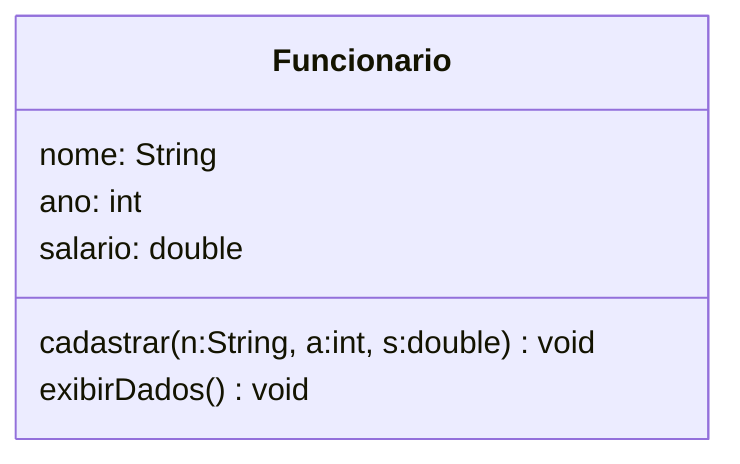
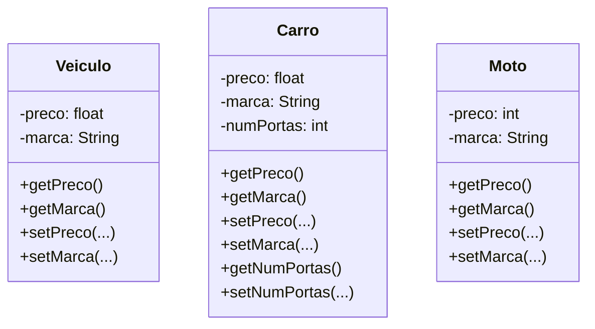
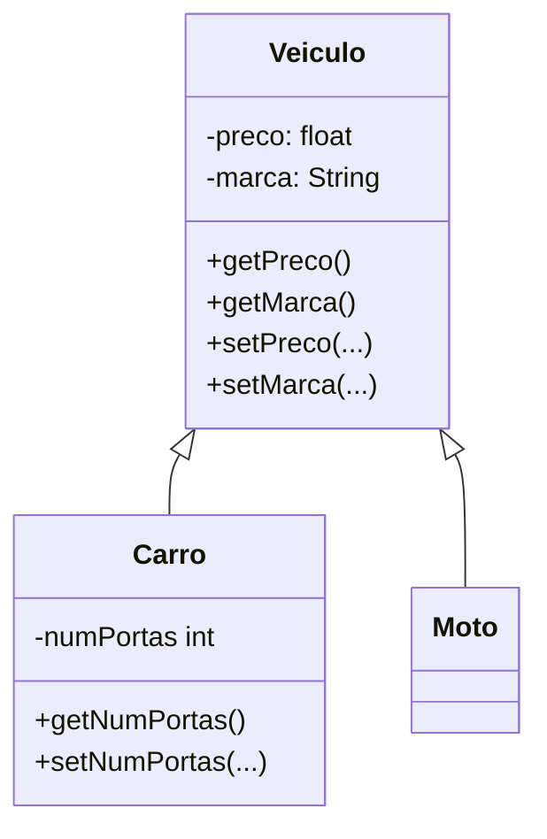
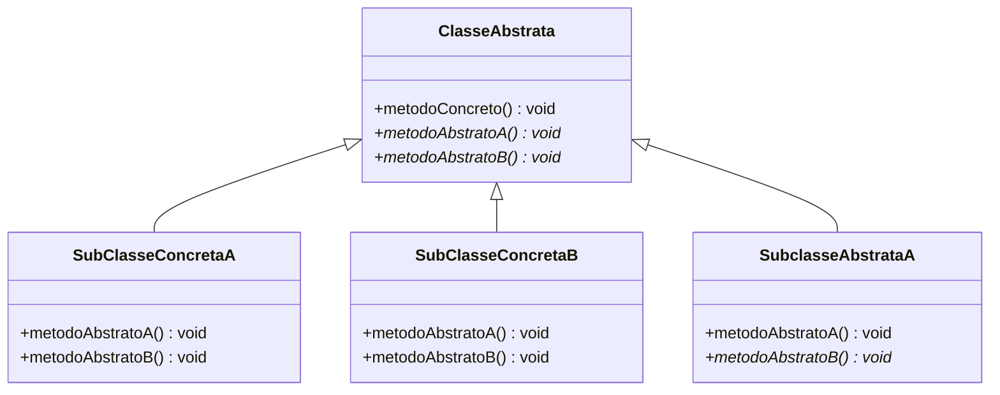
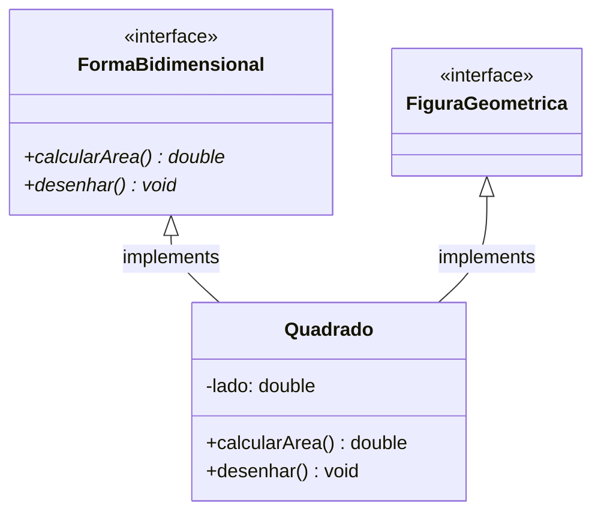
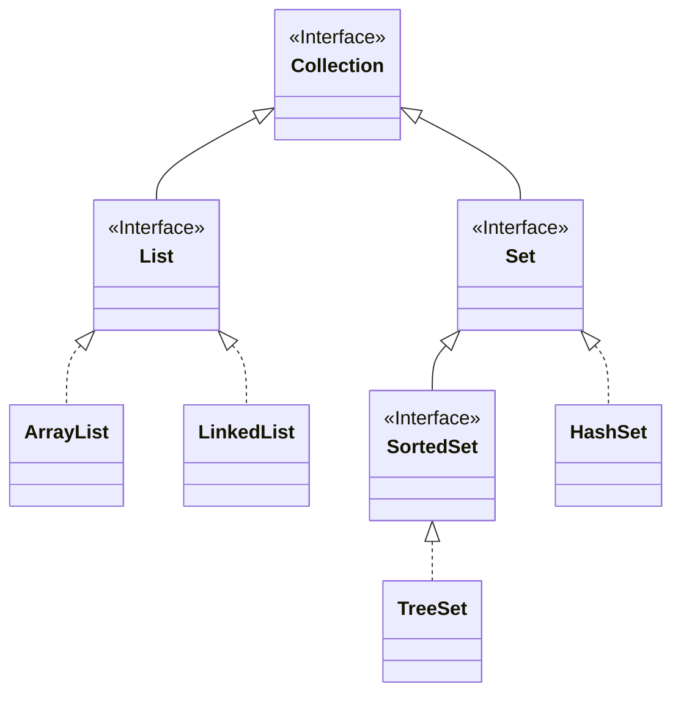

# Paradigmas de Programação

## Sumário

1. [Introdução a Linguagem Java](#introdução-a-linguagem-java)
2. [Linguagem e Paradigma de Programação](#linguagem-e-paradigma-de-programação)
3. [Classe e Objeto](#classe-e-objeto)
4. [Arrays em Java](#arrays-em-java)
5. [Classe String em Java](#classe-string-em-java)
6. [Encapsulamento](#encapsulamento)
7. [Construtores](#construtores)
8. [Atributos do tipo Classe](#atributos-do-tipo-classe)
9. [Herança](#herança)
10. [Sobrecarga](#sobrecarga)
11. [Classe Abstrata](#classe-abstrata)
12. [Interface](#interface)
13. [Polimorfismo](#polimorfismo)

## Introdução a Linguagem Java

* Orientada a objetos
* Gerenciamento automático de memória
* Portabilidade
* Composto por dois ambientes:
    * JDK (Java Development Kit) - Ambiente de Desenvolvimento:
    * JRE (Java Runtime Environment) - Ambiente de Execução: Consiste na JVM e na Java API
        * javac - compilador
        * jar - empacotador
        * javadoc - ferramenta para geração de documentação
        * JVM (JAVA Virtual Machine): Máquina virtual que interpreta e executa o código java compilado.

O código fonte é o **BemVindo.java** e após a compilação usando `javac` irá gerar o cexecutavel **BemVindo.class**, e para executar use `java BemVindo`.

### Classes

Todo programa consiste de pelo menos uma declaração de classe.

```java
public class BemVindo {
    ...
}
```
A palavra class introduz uma classe.

Programa Principal: Método main()

```java
public class BemVindo {
    public static void main(String[] args) {
        // Método principal
        System.out.println("Olá, seja bem-vindo!");
    }
}
```

### Entrada e Saída

```java
import java.util.Scanner;

public class Principal {
    public static void main(String[] args)
    {
        Scanner input = new Scanner(System.in); // Faz a instância do Scanner
        int num;
        System.out.print("Digite um número: ");
        
        num = input.nextInt;

        System.out.println("Número digitado: " + num);

        input.close();
    }
}
```

### Tipos de Dados
* lógico: boolean
* textual: char e String
* ponto flutuante: float ou double
* inteiro: byte (8 bits), short (16 bits), int (32 bits) e long (64 bits)

Váriavel final: váriavel não modificável, constante.  
`final String msg = "Bem vindo!";`

## Linguagem e Paradigma de Programação

Uma linguagem é composta por dois conjuntos de regras para definir programas:  
ex:
```java
if (x > 0)
    x = x + 1
```  

* Sintaxe: representação simbólica; `if (<expr>) <instrução>`
* Semântica: conceito que ela representa; se o valor da expressão for verdadeiro, a variável x é incrementada em 1

### Tipos de Paradigmas

#### Imperativo
Instruções passadas devem especificar o passo a passo das ações que serão executadas. Fortran, Pascal, Cobol, C

#### Estruturado
Também conhecido como procedural, capacidade de modularização (métodos, funções, rotinas). As instruções podem ser formadas por umas das seguintes estruturas: sequência, condicionais, repetição.

#### Orientado a Objetos
Organização do código por objetos que contém dados, estados próprios e métodos que alteram e recuperam os dados/estados. Os objetos comunicam entre si para compor a lógica do programa. Java, C++, Simula, Smaltalk, C#

#### Declarativo
Fluxo lógico implícito. Linguagens de alto nível que permite ao programador dizer apenas o que deseja. SQL

#### Lógico
Especifica-se apenas fatos e regras de inferência. Retorno escrito em forma de pergunta.

#### Funcional 
Descreve a computação como uma expressão a ser avaliada. A principal forma de estruturar o programa é pela definição e aplicação de funções.

> Na prática, muitas linguagem são ***multiparadigmas***.

## Classe e Objeto

Uma classe representa um grupo de objetos com características (atributos) e comportamentos (métodos) semelhantes.

```java
public class <NomeDaClasse>{
    // Atributos
    // Métodos
}
```

Conveção:
* Inicial em maiúsculo
* CamelCase (ex: **SampleClassName**)

### Atributos
`<modif_acesso> <tipo> <identificador>;`

#### Modificador de acesso

1. **public** (público): visível a todas classes
1. **private** (privado): visível somente na classe que está
1. **protected** (protegido): visível na classe que está e na pai

#### Identificador
Nome do atributo, segue as convenções:

* Incial em minúsculo
* camelCase (ex: **ano, anoC, anoDeContrato**)

### Métodos
`<modif_acesso> <tipo_retorno> <identificador>(parâmetros) {};`

* Em geral tem modificador de acesso *public*.  
* Segue as mesmas conveções de nomes que atributos.

```java
public class Funcionario{
    String nome;
    int ano;
    double salario;

    public void exibirdados() {...}
}
```

### Objetos

É a instância de uma classe.

#### Palavra-chave *this*

```java
this.nome = nome;
this.ano = ano;
this.salario = salario;
```

Usada para referenciar um atributo da classe.
* Diferencia uma variável de escopo (parâmetro) de uma variável de classe (atributo).
* Melhora legibilidade do código.

```java
public void exibirDados()
{
    System.out.println("Nome" + this.nome);
    System.out.println("Ano" + this.nome);
    System.out.println("Nome" + this.nome);
}
```

### Representação UML (Unified Modeling Language)  

Define a estrutura das classes de um sistema.



## Arrays em Java

* Um grupo de variáveis que contém valores do mesmo tipo. 
* Arrays são objetos.  
* Para se criar um array se usa a palavra ***new***, especificando o tipo e número de elementos.

#### Array Unidimensional

```java
// Exemplos de criação de array
int[] x;
x = new int[7];

// Não é necessário utilizar new
int[] n = {10, 20, 30, 40};

// Posição dos colchetes não interfere.
int num1[]; int[] num1;
```

#### Array Bidimensional

```java
int [][] m;
m = new int [3][4];

int [][] n = {{1,2}, {3,4}, {5,6}};
```

|  |0 |1 |
|--|--|--|
|0 |1 |2 |
|1 |3 |4 |
|2 |5 |6 |

##### Imprimindo uma matriz

```java
public class Matriz{
    public static void main(String[] args)
    {
        int [][] m = {{1,2}, {3,4}, {5,6}};
        int lin, col;

        for (lin = 0; lin < m.length; lin++)
        {
            for (col = 0; col < m[lin].length; col++)
            {
                System.out.print(m[lin][col] + " ");
            }
            System.out.print("\n");
        }
    }
}
```

* `imprimirDadosMat(m);` Quando é passado um array como parâmetro para uma função, ele é passado **por valor**. O Java não permite escolha de passagem por valor ou por referência.

## Classe String em Java

`String texto = "Seja bem vindo.";`

* São tratados com tipos primitivos, logo não é necessário fazer o import.
* Possui mais de 50 métodos
    * length: calcula o tamanho da string
    ```java
    String frase = "Bom dia amigo!";
    int tam = frase.length();
    System.out.printf("O tamanho da sentença \"%s\" é: %d\n", frases, tam);
    ```
    * equals: Compara se duas strings são iguais ou não
    * compareTo(String s): Compara duas strings em ordem alfabética retornando zero se as strings forem iguais e diferente de zero se forem diferentes
    * compareToIgnoreCase(String s): Compara duas strings em ordem alfabética ignorando maiúsculas e minúsculas.
    * concat(): Concatena duas strings
    * indexOf(): Retorna o índice da primeira ocorrência de um caractere
    * replace(char caractere_antigo, char caractere_novo): Retorna uma nova string substituindo todas as ocorrências do caractere_antigo pelo caractere_novo
    * substring(int inicio, int fim): Retorna uma parte da string original, delimitada pelos índices de início e fim
    * charAt(int pos): Retorna o caractere que está na posição pos da String
    * toLowerCase(): Retorna uma nova string com todas as letras em minúsculo
    * toUpperCase(): Retorna uma nova string com todas letras em maiúsculo
    

## Encapsulamento

Não é preciso conhecer todas as partes de uma classe para entender seu funcionamento.

* Segurança;
* Relação de confiança entre as classes: utilizar um método sem conhecer os detalhes da implementação;

Regra do Encapsulamento: :star: **Nenhum objeto pode acessar os atributos de outro diretamente.** :star:

### Como encapsular:
1. Atributos declarados como **privados**.
```java
public class Carro {
    private char tipo;
}
```

2. Criar métodos get/set para <ins>cada atributo</ins> da classe.
```java
public char getTipo() {
    return this.tipo;
}

// Validações devem ser sempre feitas na função set
public void setTipo(char tipo) {
    if (tipo == 'F' || tipo == 'D')
        this.tipo = tipo;
}
```

##### Classe Encapsulada:

```java
public class <NomeClasse>
{
    // Atributos
    // Métodos get/set
    // Outros métodos
}
```

##### Tipo Boolean

O padrão get/set **não** vale para variáveis boolean. Esses atributos são acessados via *is* e *set*.

```java
public boolean isLigado() {
    return this.ligado;
}
public void setLigado(boolean ligado) {
    this.ligado = ligado;
}
```
##### Método toString()

* Retorna a representação de um objeto em string. Está presente em todas as classes.

```java
// Alterando o método toString
public String toString() 
{
    return String.format("Nome: %s \nAno: %d\nSalario: %f", this.nome, this.ano, this.salario);
}
```

## Construtores

```java
public class <NomeClasse> {
    // Atributos
    // Construtores
    // Métodos get/set
    // Outros métodos
}
```
* Toda classe possui um construtor.
* Uma classe pode ter vários construtores.
* São chamados automaticamente quando instâncias de objetos são criadas por meio da palavra chave **new**.

```java
public class Principal {
    public static main void(String[] args) {
        Funcionario obj1 = new Funcionario();
        Funcionario obj2 = new Funcionario();
    }
}
```

Se nenhum construtor é definido na classe, Java irá definir um construtor **padrão (default)**.

Características do construtor default: 

* Não possui parâmetro.
* Não possui conteúdo.
* Não possui tipo de retorno.
* Possui mesmo nome da classe.
* Possui mesmo modificador de acesso da classe.
* Conteúdo padrão inicializado:
    * boolean: false
    * char: vazio
    * int/ponto flutuante: zero
    * instância de classe: NULL

Construtores são usados para inicializar uma classe com valores específicos.

```java
public Funcionario(String nome, int ano, double salario) {
    this.nome = nome;
    this.ano = ano;
    this.salario = salario;
}
```

## Atributos do tipo Classe

!!! warning
    INCOMPLETO, MELHORAR ESSA PARTE

### Relacionamento de classes na UML

Associação: indica que uma classe depende da outra.
* Associação forte: a classe A possui um ou mais atributos do tipo da classe B
* Multiplicidade 1..1: indica que **apenas um** objeto da classe B se relaciona com objetos da classe A

## Herança

Uma forma de reutilização em que novas classes são criadas, absorvendo membros de uma classe existente e aprimorada com novas características e funcionalidades.

* Uma subclasse **"herda"** atributos e métodos de sua superclasse e os utiliza como se fossem declarados dentro da própria classe.

##### Representação sem herança: 



* Muita repetição de código!

##### Representação com herança: 



* superclasse (pai)   -> Veiculo
* subclasses (filhas) -> Carro e Moto
* Todos os carros e motos são veículos, mas nem todos veículos são carros

#### Como implementar Herança

1. Usar a palavra **extends**
2. Declarar os atributos da superclasse como **protected**
    * Membros protected podem ser acessados por:
        1. membros da própria superclasse
        2. membros das subclasses
        3. membros da classe no mesmo pacote

```java
public class Veiculo {
    protected float preco;
    protected String marca;
    // ...
}

public class Carro extends Veiculo {
    // ...
}

public class Moto extends Veiculo {
    // ...
}
```

##### Tipos de Herança

* Herança Simples: uma classe é derivada de uma única superclasse
* Herança Múltipla: uma classe é derivada de mais de uma superclasse
    * O Java **NÃO** permite herança múltipla

##### Quando utilizar Herança?
* Regra: realizar a pergunta ***"É um?"***
* Ex: 
    * Cavalo *é um* Animal?
    * Alface *é um* Vegetal?
    * Gorgonzola *é um* Queijo?
    * Carro *é um* Veículo?

##### Herança em Java

Em Java todas as classes herdam da classe **Object**, alguns de seus métodos são:

* toString(): retorna a representação de um objeto em String
* equals(Object obj): compara dois Objects retornando true se forem iguais e false caso diferentes
* hashCode(): retorna um código hash (int) para o objeto

!! Construtores **não** são herdados pelas subclasses. !!

Instanciar um objeto da subclasse inicia uma cadeia de chamadas de construtores pais, implicitamente ou explicitamente (via super).

```java
public class Veiculo {
    protected float preco;
    protected String marca;

    public Veiculo(float preco, String marca) {...}
}

public class Carro extends Veiculo {
    private int numPortas;

    public Carro(int numPortas, float preco, String marca) {
        super(preco, marca); // Chamada explicita
    }
}
```
#### Métodos - Herança

1. Sobreposição de método 
    * A classe filha pode fornecer outra implementação para um método herdado, fazendo o **overriding** da classe pai.

    ```java
    public class Pai {
        public void metodoX(int p) {
            ...
        }
    }

    public class Filho extends Pai {
        public void metodoX(int p) {
            // O código metodoX do filho sobrepõe o do pai
        }
    }
    ```
    * Regras:
        * O nome do método, a lista de parâmetros e o tipo de retorno **devem** ser os mesmos.
        * O nível de acesso **não pode** ser mais restrito que o método redefinido.

2. Acesso do método da superclasse usando **super()**
    * Para acessar um método da superclasse que também foi definido na subclasse:
    `super.nomeMetodo(lista de parâmetros);`

    ```java
    public class Pai {
        public void metodoX(int p) {...}
    }

    public class Filho extends Pai {
        public void metodoX(int p) {
            super.metodoX(p);
        }
    }
    ```

##### Notação @Override
Indica que o método da classe filha sobrepões o método da classe pai.
* Vantagens:
    * Se o método filho não substituir o método pai, o código não compila.
    * Torna o código fonte mais legível.

    ```java
    public class Filho extends Pai {
        @Override
        public void metodoX(int p) {
            // ...
        }
    }
    ```
#### Classe Final

Uma classe é declarada como final quando ela não puder ser herdada por nenhuma outra classe.

```java
public final class <NomeClasse> {
    // ...
}
```

Qualquer tentativa de criar subclasses resultará em **erro de compilação**.

## Sobrecarga

Tipos:

* Sobrecarga de construtores
* Sobrecarga de métodos

### Sobrecarga de Construtores

Uma classe pode ter vários construtores sobrecarregados permitindo que objetos dessa classe sejam inicializados de diferentes maneiras, basta fornecer múltiplas declarações de construtor com assinaturas diferentes.

Regras:
* A lista de parâmetros **tem** que mudar;
* O modificador de acesso **pode** mudar.

```java
public class ContaBancaria{
    private String nomeT;
    private double saldo;

    // Construtor 1 - padrão
    public ContaBancaria() {}

    // Construtor 2
    public ContaBancaria(double saldo) {
        this.setSaldo(saldo);
    }

    // Construtor 3
    public ContaBancaria(String nomeT) {
        this.setNomeT(nomeT);
    }

    // Construtor 4
    public ContaBancaria(String nomeT, double saldo) {
        this.setNome(nomeT);
        this.setSaldo(saldo);
    }
}
```

Um construtor pode ser chamado dentro de outro utilizando **this**, que deve vir sempre na primeira linha do construtor. Isso evita repetição de código.

```java
// Construtor 1 - padrão
public ContaBancaria() {}

// Construtor 2
public ContaBancaria(double saldo) {
    this(" ", saldo);
}

// Construtor 3
public ContaBancaria(String nomeT) {
    this(nomeT, 0.0);
}

// Construtor 4
public ContaBancaria(String nomeT, double saldo) {
    this.setNome(nomeT);
    this.setSaldo(saldo);
}
```

### Sobrecarga de Métodos

Capacidade de possuir métodos diferentes com o mesmo nome, mas com parâmetros diferentes.

Regras:
* Nome **tem** que ser o mesmo;
* Lista de parâmetros **tem** que mudar;
* Tipo de retorno **pode** mudar;
* Modificador de acesso **pode** mudar.

```java
public void imprimir(int i) {...}
public void imprimir(float f) {...}
public void imprimir(String s) {...}
```

## Classe Abstrata

É uma superclasse extremamente genérica, que não pode ser instanciada.


* Uma classe abstrata é declarada usando *abstract*;
* Deve ter **zero ou mais** métodos abstratos. (Se contém um método abstrato deve ser declarada como abstrata);
* Pode possuir métodos abstratos e não abstratos.

```java
public abstract class Funcionario{} // Classe abstrata
```

#### Método abstrato

* Um método abstrato também é declarado usando *abstract*.
* **Não** possui implementação, apenas a assinatura do método.

```java
public double calcularSalario() { /* implementação */ }

public abstract double calcularSalario(); // Método abstrato
```
* Atributos e construtores **não** pode ser abstratos.

---

* Uma classe concreta (não abstrata), que estende uma classe abstrata, deve fornecer a implementação dos métodos abstratos.
* A primeira classe concreta que herdar essa hierarquia tem que obrigatoriamente fornecer a implementação dos métodos abstratos herdados.
* Caso a classe que estende outra que tem método abstrato e não a implementa, então ela também deve ser declarada como abstrata.

Exemplo:



```java
public abstract class ClasseAbstrata {
    // Atributos
    // Métodos get e set
    // Outros métodos
    public void metodoConcreto() { /*implementação*/ };
    public abstract void metodoAbstratoA();
    public abstract void metodoAbstratoB();
}

public class SubClasseConcretaA extends ClasseAbstrata {
    // Atributos
    // Métodos get e set
    // Outros métodos
    public void metodoAbstratoA() { /*implementação*/ }
    public void metodoAbstratoB() { /*implementação*/ }
}

public class SubClasseConcretaB extends ClasseAbstrata {
    // Atributos
    // Métodos get e set
    // Outros métodos
    public void metodoAbstratoA() { /*implementação*/ }
    public void metodoAbstratoB() { /*implementação*/ }
}

public abstract class SubClasseAbstrataA extends ClasseAbstrata {
    // Atributos
    // Métodos get e set
    // Outros métodos
    public void metodoAbstratoA() { /*implementação*/ }
    public abstract void metodoAbstratoB();
}
```

## Interface

* São declaradas como *interface*;
* Define um conjunto de métodos, mas não define **como** devem ser implementados;

    ```java
    public abstract double calcularArea();
    public abstract void desenhar();
    ```

* Como a herança múltipla não é permitida em Java, interface serve como opção;



```java
public interface FiguraGeometrica {
    public abstract double calcularArea();
    public abstract void desenhar();
}

public interface FiguraGeometrica {};

public class Quadrado implements FiguraGeometrica{
    private double lado;

    public double calcularArea() { /*implementação*/ }
    public void desenhar() { /*implementação*/ }
}
```

* Não possuem atributos;
* As constantes são implicitamente definidas como public, static e final;

    ```java
        // Todas declarações são equivalentes em uma interface
        double PI = 3.14;
        public double PI = 3.14;
        public static final double PI = 3.14;
    ```
* Não possuem construtor;
* Todos métodos são implicitamente public e abstract;

##### Interface ou Classe Abstrata

Interface é a melhor forma de definir um tipo que permite múltiplas implementações. Uma exceção a essa regra é o caso em que a facilidade de evolução é considerada mais importante que a flexibilidade, nesse caso a classe abstrata se sobressai.

## Polimorfismo

Refere-se a capacidade de diferentes objetos responderem de diferentes maneiras a uma mesma função ou método.

***"polimorfismo = muitas formas"***

### Tipos de Polimorfismo

#### 1. Universal

* Ocorre em tempo de execução.

    ##### 1.1 Inclusão

    * É alcançado através da herança e interface. Permite a uma classe herdar características de outra, possibilitando o uso de uma classe base para referenciar objetos de classe derivadas.
    * Uma variável do tipo da superclasse pode armazenar objetos da subclasse.

    ```mermaid
    classDiagram
    direction TB

    class Animal {
        +emitirSom() void
    }
    <<Abstract>> Animal
    class Cachorro {
        +emitirSom() void
    }
    class Gato {
        +emitirSom() void
    }
    class Pato {
        +emitirSom() void
    }

    Animal <|-- Cachorro
    Animal <|-- Gato
    Animal <|-- Pato
    ```

    ```java
    public abstract class Animal {
        public Animal() {};
        public abstract void emitirSom();
    }
    public class Cachorro extends Animal {
        public Cachorro() {};
        public void emitirSom() {
            System.out.println("Au au!");
        }
    }
    public class Gato extends Animal {
        public Gato() {};
        public void emitirSom() {
            System.out.println("Miau.");
        }
    }
    public class Pato extends Animal {
        public Pato() {};
        public void emitirSom() {
            System.out.println("Quack!!!");
        }
    }

    public class Principal {
        public static void main(String[] args) {
            Animal x, y; 
            x = new Cachorro();
            x.emitirSom();
            y = new Gato();
            y.emitirSom();
            // x e y são referências da classe Animal, x apontando para um objeto do
            // tipo Cachorro e y para um objeto do tipo Gato.
        }
    }
    ```
    
    #### 1.2. Paramétrico

    * Permite que funções ou classes sejam escritas genericamente, de modo que possam manipular tipos de dados que são especificados apenas no momento da utilização.
    * Origem no Casting(conversão de tipos), mas elimina sua necessidade.
    * Implementado em Java por meio do Generics, que permite que uma classe trabalhe com uma grande varieadade de tipo (um de cada vez).

    ```java
    Produto tv = new Televisao();
    Produto cel = new Celular();

    // Qualquer subclasse de Produto poderá ser armazenado no objeto carrinho
    LinkedList<Produto> carinho = new LinkedList<Produto>();
    
    carrinho.add(tv);
    carrinho.add(cel);

    Produto p = carrinho.iterador().next();
    ```

    **Criando e utilizando classe com Generics**

    ```java
    public class BasicGeneric <A> {
        // A é o parâmetro da classe (não pode ser do tipo primitivo)
        private A dado;

        public A getDado() {
            return this.dado;
        }
        public void setDado(A dado) {
            this.dado = dado;
        }
    }
    ```

    ```java
    String nome = "Laura";

    // Instância da classe BasicGeneric "presa" ao tipo String
    BasicGeneric<String> bG = new;
    BasicGeneric<String>();

    bG.setDado(nome);

    String nome1 = bg.getDado(); // Sem casting
    ```

    * Tipo Generic do Java são restritos a objetos e **não** funcionarão com tipos primitivos.
    * Evite usar instâncias de classe Generics com o tipo Object, isso permite incluir qualquer tipo de objeto na lista. 
        `LinkedList<Object> lista = new LinkedList<Object>();`
    
#### 2. Ad Hoc

* Ocorre em tempo de compilação.

    ##### 2.1. Sobrecarga

    * Métodos com mesmo nome e assinaturas (lista de parâmetros) diferentes podem ter comportamentos totalmente distintos.

    ```java
    public class MathOperations {
        int soma(int a, int b) {
            return a + b;
        };
        double soma(double a, double b) {
            return a + b;
        };
        int soma(int a, int b, int c) {
            return a + b + c;
        };
    }
    ```

    ##### 2.2. Coerção

    * Também conhecida como *casting* (conversão automática de tipos de dados), consiste em forçar um objeto a assumir um tipo específico.
    * Útil quando se deseja definir um modelo genérico que será redefinido ou especializado para outras classes de objetos. Para isso, o modelo deve ser construído a partir de tipos abstratos como interfaces e classes abstratas.

    ##### Tipos de coerção:
    
    1. **Upcasting** 
        * Converter um tipo derivado (subclasse) para um tipo base (superclasse).
        * Sempre seguro e automático.

        ```java
        public class Animal {
            void emitirSom() {
                System.out.println("AAAAAAAAA");
            }
        }
        
        public class Cachorro extends Animal {
            @Override
            void emitirSom() {
                System.out.println("Auuu");
            }
        }

        public class Principal {
            public static void main(String[] args) {
                Cachorro meuDog = new Cachorro();
                Animal meuAnimal = meuDog; // Upcasting
                meuAnimal.emitirSom(); // output: Auuu
            }
        }
        ```

    2. **Downcast**
        * Converter um tipo base (superclasse) para um tipo derivado (subclasse).
        * Sempre explícita e pode ser insegura, pois uma superclasse pode não necessariamente ser uma instância de uma subclasse específica.
        * É feito usando o operador `(Type)` de casting.

        ```java
        Animal meuAnimal = new Dog();
        Cachorro meuDog = (Dog) meuAnimal; // Downcast
        meuDog.emitirSom();
        ```

        * Se o objeto for da subclasse, a coerção será válida, mas se não for, ocorrerá um erro.
        * Para proteger o código dessa incerteza, deve-se usar o operador especial **instanceof**.

        ```java
        Animal meuAnimal = new Dog();
        if (meuAnimal instanceof Cachorro) {
            Cachorro meuDog = (Cachorro) meuAnimal;
            meuDog.emitirSom();
        }
        ```

## Coleções



* Implementam estrutura de dados que armazenam qualquer tipo de objeto.
* Não aceitam tipos primitivos como elementos, apenas instâncias de objetos.
* Exemplos: List (ArrayList, LinkedList), Set (HashSet, TreeSet).

#### Classes Wrapper

* Para guardar tipos primitivos devemos usar as classes wrapper(ex: Integer, Double, Float).
* Permite a utilização de tipos primitivos como objetos.

| Classe Wrapper | Tipo primitivo |
|       ---      |       ---      |
| Boolean        | boolean        |
| Byte           | byte           | 
| Character      | char           |
| Short          | short          | 
| Integer        | int            |
| Long           | long           |
| Float          | float          |
| Double         | double         |

#### Listas

* Uma Collection que pode conter elementos duplicados.
* Mantém uma ordenação específica entre os elementos.
* Resolve os problemas em relação ao *array* (busca, remoção, tamanho, ...).
* É implementada por várias classes.

    1. **ArrayList**
        * Implementado como um array.
        * Acesso sequencial e aleatório extremamente rápido.
        * Pode ser redimensionado dinamicamente.
        * **Não** é uma lista de arrays, é uma lista de objetos.
        * Internamente, usa um array (encapsulado) para armazenar dados.
        * O ArrayList não remove elementos duplicados.
        * Começa com um tamanho fixo, que vai aumentando conforme necessário.

        ```java
        ArrayList<T> a = new ArrayList<T>();
        ArrayList<T> b = new ArrayList<T>(20); // 20 é a capacidade inicial da lista

        // É possível abstrair a partir da interface List
        List<T> c = new ArrayList<T>();
        Collection<T> d = new ArrayList<T>();
        ```

    ##### Métodos da interface List
    
    * **add()** pode ou não receber como parâmetro a posição na lista que desejamos que ele ocupe. 

    ```java
    Pessoa P = new Pessoa("joao", "joao@gmail.com");
    ArrayList<Pessoa> a = new ArrayList<Pessoa>();
    a.add(p); OU a.add(0, p);
    ```

    * **remove()**: informar a posição da lista a remover o elemento
    `a.remove(int indice);`

    * **get()**: ler os dados da lista
    `Pessoa p1 = a.get(int indice);`

    * **size()**: tamanho (número de elementos da lista)
    `int tamanho = a.size();`

    * **iterator()**: percorrer e acessar os elementos de uma coleção.

    ```java
    Iterator<String> i = a.iterator();
    while (i.hasNext()) {
        Pessoa pessoa = i.next();
        System.out.println(pessoa.getNome());
    }
    ```
    O *enhanced-for* é uma versão simplificada do laço também usada para percorrer coleções.

    ```java
    Iterator<String> i = a.iterator();
    for (Pessoa pessoa: a) {
        System.out.println(pessoa.getNome());
    }
    ```

    1. **LinkedList**
        * Lista encadeada.
        * Pode ser instanciado usando o construtor com e sem parâmetro.

        ```java
        LinkedList<T> lista = new LinkedList<T>();
        LinkedList<T> lista = new LinkedList<T>(int x); // x é a capacidade inicial da lista
        ```

        * Além de implementar os métodos da interface List (add, remove, get, etc) apresenta métodos para acessar o **início** ou **fim** da lista.

        ```java
        lista.add(objeto);      // a lista gerencia onde colocar o elemento
        lista.addFirst(objeto); // adicionado ao inicio da lista
        lista.addLast(objeto);  // adicionado ao final da lista   

        lista.get(int i);       // recupera elemento de indice i
        lista.getFirst();       // recupera elemento da primeira posicao
        lista.getLast();        // recupera elemento da ultima posicao

        lista.remove(int i);    // remove elemento de indice i
        lista.removeFirst();    // remove elemento da primeira posicao
        lista.removeLast();     // remove elemento da ultima posicao
        ```

##### LinkedList x ArrayList

As diferenças se baseiam no custo de inserção, remoção e iteração da lista.
* LinkedList é mais rápida para inserção e iteração, sem remover ou alterar.
* ArrayList é melhor se você precisa de acesso com índice (acesso aleatório), ou seja, quando você usa o método get(i).

#### Set (Conjunto)


---

### Dúvidas
* Classes abstratas devem ter construtores?
* Dentro de uma classe, funções internas, podem usar o *this.* ou devem usar o get/set?
* Devo usar get/set em construtores?