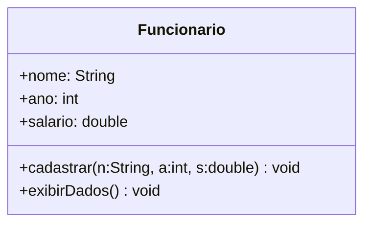

# Paradigmas de Programação

## Sumário

1. [Introdução a Linguagem Java](#introdução-a-linguagem-java)
2. [Linguagem e Paradigma de Programação](#linguagem-e-paradigma-de-programação)
3. [Classe e Objeto](#classe-e-objeto)
4. [Arrays em Java](#arrays-em-java)
5. [Classe String em Java](#classe-string-em-java)

## Introdução a Linguagem Java

* Orientada a objetos
* Gerenciamento automático de memória
* Portabilidade
* Composto por dois ambientes:
    * JDK (Java Development Kit) - Ambiente de Desenvolvimento:
    * JRE (Java Runtime Environment) - Ambiente de Execução: Consiste na JVM e na Java API
        * javac - compilador
        * jar - empacotador
        * javadoc - ferramenta para geração de documentação
        * JVM (JAVA Virtual Machine): Máquina virtual que interpreta e executa o código java compilado.

O código fonte é o **BemVindo.java** e após a compilação usando `javac` irá gerar o cexecutavel **BemVindo.class**, e para executar use `java BemVindo`.

### Classes

Todo programa consiste de pelo menos uma declaração de classe.

```java
public class BemVindo {
    ...
}
```
A palavra class introduz uma classe.

Programa Principal: Método main()

```java
public class BemVindo {
    public static void main(String[] args) {
        // Método principal
        System.out.println("Olá, seja bem-vindo!");
    }
}
```

### Entrada e Saída

```java
import java.util.Scanner;

public class Principal {
    public static void main(String[] args)
    {
        Scanner input = new Scanner(System.in); // Faz a instância do Scanner
        int num;
        System.out.print("Digite um número: ");
        
        num = input.nextInt;

        System.out.println("Número digitado: " + num);

        input.close();
    }
}
```

### Tipos de Dados
* lógico: boolean
* textual: char e String
* ponto flutuante: float ou double
* inteiro: byte (8 bits), short (16 bits), int (32 bits) e long (64 bits)

Váriavel final: váriavel não modificável, constante.  
`final String msg = "Bem vindo!";`

## Linguagem e Paradigma de Programação

Uma linguagem é composta por dois conjuntos de regras para definir programas:  
ex:
```java
if (x > 0)
    x = x + 1
```  

* Sintaxe: representação simbólica; `if (<expr>) <instrução>`
* Semântica: conceito que ela representa; se o valor da expressão for verdadeiro, a variável x é incrementada em 1

### Tipos de Paradigmas

#### Imperativo
Instruções passadas devem especificar o passo a passo das ações que serão executadas. Fortran, Pascal, Cobol, C

#### Estruturado
Também conhecido como procedural, capacidade de modularização (métodos, funções, rotinas). As instruções podem ser formadas por umas das seguintes estruturas: sequência, condicionais, repetição.

#### Orientado a Objetos
Organização do código por objetos que contém dados, estados próprios e métodos que alteram e recuperam os dados/estados. Os objetos comunicam entre si para compor a lógica do programa. Java, C++, Simula, Smaltalk, C#

#### Declarativo
Fluxo lógico implícito. Linguagens de alto nível que permite ao programador dizer apenas o que deseja. SQL

#### Lógico
Especifica-se apenas fatos e regras de inferência. Retorno escrito em forma de pergunta.

#### Funcional 
Descreve a computação como uma expressão a ser avaliada. A principal forma de estruturar o programa é pela definição e aplicação de funções.

> Na prática, muitas linguagem são ***multiparadigmas***.

## Classe e Objeto

Uma classe representa um grupo de objetos com características (atributos) e comportamentos (métodos) semelhantes.

```java
public class <NomeDaClasse>{
    // Atributos
    // Métodos
}
```

Conveção:
* Inicial em maiúsculo
* CamelCase (ex: **SampleClassName**)

### Atributos
`<modif_acesso> <tipo> <identificador>;`

#### Modificador de acesso

1. **public** (público): visível a todas classes
1. **private** (privado): visível somente na classe que está
1. **protected** (protegido): visível na classe que está e na pai

#### Identificador
Nome do atributo, segue as convenções:

* Incial em minúsculo
* camelCase (ex: **ano, anoC, anoDeContrato**)

### Métodos
`<modif_acesso> <tipo_retorno> <identificador>(parâmetros) {};`

* Em geral tem modificador de acesso *public*.  
* Segue as mesmas conveções de nomes que atributos.

```java
public class Funcionario{
    String nome;
    int ano;
    double salario;

    public void exibirdados() {...}
}
```

### Objetos

É a instância de uma classe.

#### Palavra-chave *this*

```java
this.nome = nome;
this.ano = ano;
this.salario = salario;
```

Usada para referenciar um atributo da classe.
* Diferencia uma variável de escopo (parâmetro) de uma variável de classe (atributo).
* Melhora legibilidade do código.

```java
public void exibirDados()
{
    System.out.println("Nome" + this.nome);
    System.out.println("Ano" + this.nome);
    System.out.println("Nome" + this.nome);
}
```

### Representação UML (Unified Modeling Language)  

Define a estrutura das classes de um sistema.



## Arrays em Java

* Um grupo de variáveis que contém valores do mesmo tipo. 
* Arrays são objetos.  
* Para se criar um array se usa a palavra ***new***, especificando o tipo e número de elementos.

#### Array Unidimensional

```java
// Exemplos de criação de array
int[] x;
x = new int[7];

// Não é necessário utilizar new
int[] n = {10, 20, 30, 40};

// Posição dos colchetes não interfere.
int num1[]; int[] num1;
```

#### Array Bidimensional

```java
int [][] m;
m = new int [3][4];

int [][] n = {{1,2}, {3,4}, {5,6}};
```

|  |0 |1 |
|--|--|--|
|0 |1 |2 |
|1 |3 |4 |
|2 |5 |6 |

##### Imprimindo uma matriz

```java
public class Matriz{
    public static void main(String[] args)
    {
        int [][] m = {{1,2}, {3,4}, {5,6}};
        int lin, col;

        for (lin = 0; lin < m.length; lin++)
        {
            for (col = 0; col < m[lin].length; col++)
            {
                System.out.print(m[lin][col] + " ");
            }
            System.out.print("\n");
        }
    }
}
```

* `imprimirDadosMat(m);` Quando é passado um array como parâmetro para uma função, ele é passado **por valor**. O Java não permite escolha de passagem por valor ou por referência.

## Classe String em Java

`String texto = "Seja bem vindo.";`

* São tratados com tipos primitivos, logo não é necessário fazer o import.
* Possui mais de 50 métodos
    * length: calcula o tamanho da string
    ```java
    String frase = "Bom dia amigo!";
    int tam = frase.length();
    System.out.printf("O tamanho da sentença \"%s\" é: %d\n", frases, tam);
    ```
    * equals: Compara se duas strings são iguais ou não
    * compareTo(String s): Compara duas strings em ordem alfabética retornando zero se as strings forem iguais e diferente de zero se forem diferentes
    * compareToIgnoreCase(String s): Compara duas strings em ordem alfabética ignorando maiúsculas e minúsculas.
    * concat(): Concatena duas strings
    * indexOf(): Retorna o índice da primeira ocorrência de um caractere
    * replace(char caractere_antigo, char caractere_novo): Retorna uma nova string substituindo todas as ocorrências do caractere_antigo pelo caractere_novo
    * substring(int inicio, int fim): Retorna uma parte da string original, delimitada pelos índices de início e fim
    * charAt(int pos): Retorna o caractere que está na posição pos da String
    * toLowerCase(): Retorna uma nova string com todas as letras em minúsculo
    * toUpperCase(): Retorna uma nova string com todas letras em maiúsculo
    