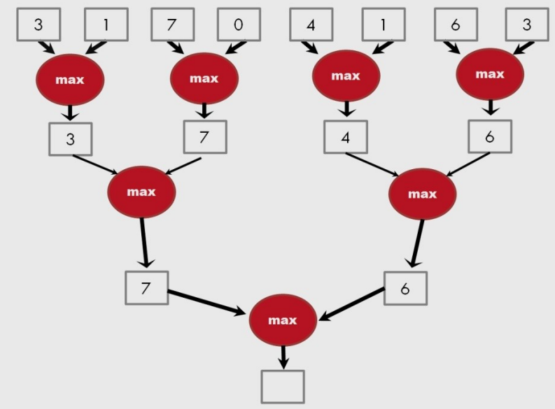

# Programação Paralela - Wagner 😒

# Processos no Unix

Programa é passivo, código + dados.
Processo é um programa em execução, com pilha, registradores, pc, espaços de memória, heap.

### Troca de contexto 
- Trocar um processo no CPU por outro. 
- SO deve salvar e  trocar estado sem perder valores em registradores.

### Criação de Processos
`fork` 
- cria um novo processo igual ao processo pai, do ponto que foi chamado em diante.
- são independentes, cada um com seu endereço e suas cópias de variáveis.
- retorna 0 para filho e PID do filho para o pai.

`exec` 
- substitui completamente o processo atual por outro.

`wait`
- processo espera término dos filhos (fila de evento).

--- 

# Threads

Uma thread é uma unidade básica de utilização de CPU, consiste de:
- um apontador de instruções (PC)
- conjunto de registradores
- espaço de pilha

Compartilha com outras threads pares (peers):
- seção do código
- seção de dados
- recursos do SO

tudo isso coletivamente é uma tarefa (task).

Um processo tradicional é igual uma tarefa com uma thread.

Beneficios:
- menor tempo de resposta
- compartilhamento de recursos
- economia de recursos
- utilização de arquitetura Multiprocessadores, enquanto uma thread está bloqueada e esperando, uma segunda na mesma tarefa pode executar

Cooperação de múltiplas threads no mesmo job confere maior vazão (*throughput*) e melhora desempenho.

**User Threads**: usadas no espaço de endereçamento do usuário, gerenciada por uma biblioteca de threads (POSIX Threads).
**Kernel Threads**: threads gerenciadas pelo SO, só o Kernel sabe que existem.

### Modelos Multithread

**Many-to-One**: Muitas threads mapeadas por uma única thread de kernel.

**One-to-One**: Cada user-level thread é mapeada para um thread de kernel

**Many-to-Many**: Permite muitas user-level thread serem mapeadas em muitas threads de kernel.

**Two-level Model (híbrido)**: Similar ao M:M, exceto que permite uma thread user-level ser ligada a uma kernel thread.

### Uso prático

**Thread Pools**

- É um número de threads a disposição para executar tarefas.
- Usualmente mais rápido "servir" uma requisição à thread pré-existente (criação e término de thread toma tempo).

**Thread Specific Data**

- Permite cada thread a ter (alguma) área de dados separada das outras.

#### Pthreads

- API padrão POSIX para criação de threads e primitivas de sincronização.
- Comum em sistemas UNIX.
- Linux tem várias implementações.

--- 

# Pthreads

Implementa o POSIX, padrão para criar e manipular threads.

Em `C` é possível utilizar a biblioteca pthread.h usando o código:  
`#include <pthread.h>`

## Pthreads API

Subrotinas da biblioteca podem ser divididas em quatro grupos:
1. **Gerencimento de thread**: criar, remover, definir atributos e entre outros;
2. **Mutexes**: lidam com exclusão mutua. São complementados por funções de atributo mutex que definem ou modificam atributos associados a mutexes;
3. **Variáveis de condição**: endereçam comunicações entre threads que compartilham um mutex, baseado em condições especificadas pelo programador. Inclui funções para criar, destruir, aguardar e sinalizar com base nos valores das variáveis.
4. **Sincronização**: Rotinas de gerenciamento de bloqueios e barreiras de leitura e escrita.

#### Compilação

`gcc codigo.c -o codigo -lpthread`

### Gerenciamento de Thread

**Criação de thread**  
`pthread_create(thread, attr, start_routine, arg)`

- thread: identificador único para thread
- attr: argumento para especificar atributos (escopo, escalonamento, endereço da pilha, uso da pilha, prioridade) de uma nova thread, NULL para padrão.
- start_routine: rotina que a thread vai executar depois de ser criada.
- arg: argumento único que pode ser passado para start_routine, se utiliza um ponteiro para struct, com todos argumentos passados por referência e convertido em ponteiro de void.

**Finalização da thread**  
Existem várias formas de finalizar uma thread:
- quando ela termina a execução;
- quando a thread chama `pthread_exit`, retornando um status para thread pai;
- quando é cancelado por outra thread com `pthread_cancel`.

**Join e Detaching**  
Join é uma das maneiras de sincronização entre threads. A thread que chamou `pthread_join` espera até que a thread especificada termine.  
`pthread_join(threadid, status)`

`pthread_detach` faz a desanexação de uma thread de outra.

### Mutexes

Exclusão mútua é uma das principais formas de se implementar sincronização entre threads e proteger dados compartilhados durante a escrita, utilizados para prevenir condições de corrida.

**Criação e destruição de Mutexes**    
Variáveis mutex são declaradas com o tipo `pthread_mutex_t` e devem ser inicializadas antes de serem usadas. Inicialmente são desbloquedos.

`pthread_mutexattr_init()` cria atributos mutex  
`pthread_mutexattr_destroy()` destroi atributos mutex  
`pthread_mutex_destroy()` libera mutex

**Locking e Unlocking de Mutex**  
`pthread_mutex_lock()` é usada por uma thread para dar lock em uma variável do tipo mutex.  
`pthread_mutex_trylock()` vai tentar dar lock, mas se já tiver om lock, irá retornar erro, pode previnir deadlock.  
`pthread_mutex_unlock()` vai liberar o mutex, desde que chamado pela thread que deu lock.

### Variáveis de condição

Outra forma de sincronizar threads, enquanto mutex implementa sincronização com controle de acesso, variáveis de condição fazem baseado no valor atual do dado. Usa menos recursos para o mesmo objetivo.

**Criando e destruindo variáveis de condição**  
Há duas formas de se declarar uma variável de condição:
- `pthread_cond_t myconvar = PTHREAD_COND_INITIALIZER` declarada de forma estática.
- `pthread_cond_init()` declarada de forma dinâmica.

`pthread_cond_destroy` libera.

### Barreiras

Quando uma thread atinge uma barreira, ela espera até que as outras atinja o mesmo ponto para continuar a execução.  
`pthread_barrier_wait()` função que implementa esse comportamento.  
É necessário declarar uma variável `pthread_barrier_t` e inicializa-lá com `pthread_barrier_init()`, que pega o número de threads que estarão participando da barreira como argumento.

---

## False Sharing
Acontece quando threads diferentes escrevem em variáveis diferentes, mas essas variáveis moram na mesma linha de cache. O hardware trata como se fosse "compartilhamento verdadeiro" daquela linha, gerando um ping-pong de invalidações e prejudicando o desempenho, mesmo sem erro lógico no programa.

## Spinlocks
É um tipo de lock baseado em *busy waiting*:
- existe uma flag atômica (livre/ocupado)
- quando uma thread quer entrar na seção crítica, ela tenta pegar o lock
    - se estiver livre -> ela entra
    - se estiver ocupada -> ela fica em loop checando a flag, até ficar livre

Geralmente mutex é melhor, pois se o lock estiver ocupado, a thread só dorme e espera. Spinlocks também são mais complexos.

---

# Algoritmo Paralelo para Redução (Parallel Reduce)

**Definição**: A operação Redução (reduce) usa um operador binário qualquer, sendo esse associativo e comutativo (chamaremos de ⊕), e aplica esse operador a um vetor de n elementos, com um valor identidade *id*: `[x_0, x_1, ..., x_n-1]`, e retorna o válor único  
`(id ⊕ x_0 ⊕ x_1 ⊕ x_2 ⊕ ... ⊕ x_n-1)`.

Ou seja, **aplica o operador a todos elementos do vetor**.

*Exemplo*: Se ⊕ for adição, então a operação *reduce* no vetor `[2,3,5,1,7,6,8,4]`, com id=0, retornaria: `36`.

**Implementação Sequencial**  
*Exemplo*: Suponha um operador *soma* como função com dois operando,

```c
resultado = id; // id=0 para soma
for (i=0; i < n; i++)
    resultado = soma(resultado, vet[i]);
```

Um algoritmo de **árvore de redução paralela** realiza N-1 operações em log(N) passos.



Para fazer em Log(N) passos precisa de N/2 processadores, mas na prática, isso nem sempre é viável.  
Por exemplo, para implementar a redução paralela, podemos dividir a computação em t grupos de elementos e fazer uma computação sequencial em cada grupo dentro de cada thread. Ao final temos de fazer a redução de t elementos, obtendo o resultado.

--- 

# Algoritmo Paralelo para Soma de Prefixos (Prefix Sum ou Scan)

- Frequentemente usado em métodos paralelos de atribuição de trabalho e alocação de recursos.
- Uma primitiva chave em muitos algoritmos paralelos para converter computação serial em paralela.

**Definição**: A operação *Scan* leva um operador associativo binário ⊕ e um vetor de n elementos `[x_0, x_1, ..., x_n]` e retorna o vetor `[x_0, (x_0 ⊕ x_1), ..., (x_0 ⊕ x_1 ⊕ ... ⊕ x_n-1)]`.

*Exemplo*: Se ⊕ for adição,  
no vetor: `[3, 1, 7, 0, 4, 1, 6, 3]`  
retornaria: `[3, 4, 11, 11, 15, 16, 22, 25]`.

### Aplicações Típicas:

Converter recorrências de sequencial:
```c
for (j=1; j < n; j++)
    out[j] = out[j-1] + f(j);
```
Para paralelo:
```c
forall(j) {
    temp[j] = f(j); // aplica f(x) em cada posição em paralelo
};
scan(out, temp); // aplica o Scan
```

Útil para algoritmos paralelos: Radix sort, Quicksort, comparação de strings, análise lexica, comparação de fluxos(stream), avaliar polinomios, resolver recorrências, operações em árvores, histogramas, ...

---

# MPI

