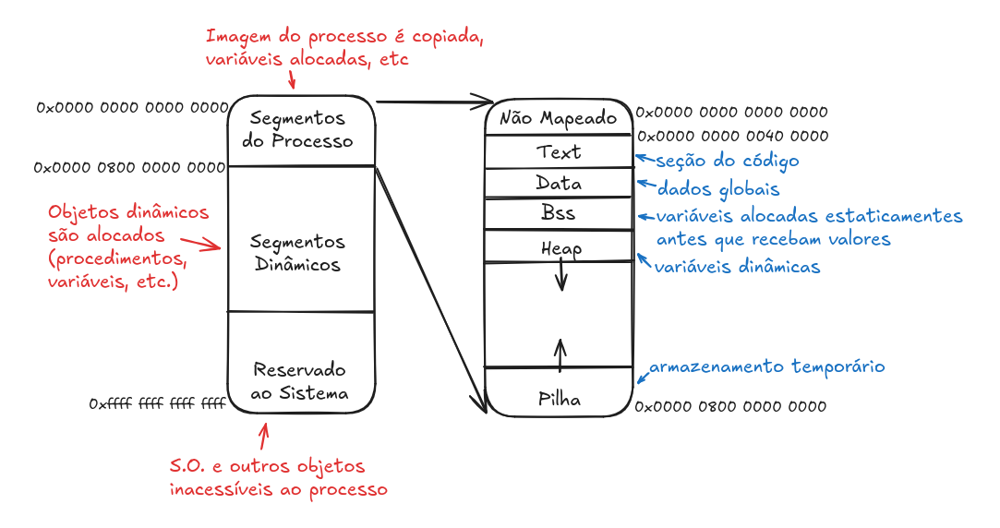

# Software Básico

### Linux: processos
**03/09**
---

* Processo = programa em execução.
* Entrega a seus programas em execução uma grande quantidade de memória virtual, podendo endereçar até 64bits (2<sup>64</sup> endereços), mas usando apenas 2<sup>48</sup> deles.

* Modelo **ELF** (Executable and Linkable Format): 


### Assembly Intel AMD64
**05/09**
---

#### Esqueleto de programa em Assembly

```c
int main (long int argc, char **argv) {
    return 13;
}
```
* Retorno pode ser visto após execução com `echo $?`.

```nasm
.section .data ; lista de variáveis globais do programa, sempre a primeira section
.section .text ; antecede os comandos em Assembly
.global _start ; símbolos que seguem devem ser conhecidos externamente
_start:        ; rótulo do endereço da primeira instrução
    movq $60, %rax
    movq $13, %rdi
    syscall
```

* A tradução do código **não** é literal.
* Execute usando:
```shell
> as esqueletoS.s -o esqueletoS.o
> ld esqueletoS.o -o esqueletoS
> ./esqueleto
> echo $?
```

#### Expressões Aritméticas

##### Alguns registradores:
0 - %rax
1 - %rcx
2 - %rdx
3 - %rbx

##### Algumas instruções:

``` nasm
movq %rax, %rbx    ; é uma função de cópia, do registrador %rax para o %rbx.
    movq $10, %rbx ; insere a CONSTANTE 10 em %rbx
    movq 10, %rbx  ; usa o ENDEREÇO de memória 10
addq %rax, %rbx    ; %rbx <- %rax + %rbx
    addq %rax, A   ; VARIÁVEL A <- %rax + A
subq %rax, %rbx    ; %rbx <- %rax - %rbx
```

##### Exemplo de conversão:

```c
long int a, b;
int main (long int argc, char **argv) {
    a = 7;
    b = 6; 
    b = a + b;
    return b;
}
```

```nasm
.section .data
    A: .quad 0       ; quad/quadword reserva 64 bits, com valor inicial 0
    B: .quad 0
.section .text
.global _start
_start:
    movq $7, A
    movq $6, B
    movq A, %rax
    movq B, %rbx
    addq %rax, %rbx
    movq $60, %rax   ; inserir $60 no %rax significa finalização do programa
    movq %rbx, %rdi
    syscall
```
* Os valores são passados para %rax e %rbx pois só é possível um acesso de memória por instrução, logo `addq B, A` não funciona.

* Na declaração das variáveis, a inclusão de um valor é necessária para que A e B sejam colocados em endereços diferentes, mas não é possível inicializar valores ali, pois aquele valor serve apenas **alocação de dados**.


