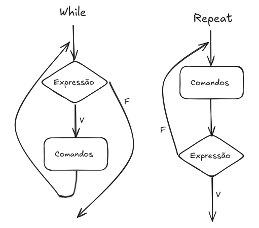

# Software Básico

## 1. Tradução e Execução de Programas

### Linux
* Um processo pode endereçar até 64 bits(2<sup>64</sup> endereços) de memória virtual, mas usa "somente" 2<sup>48</sup> endereços.

### Modelo ELF (Executable and Linkable Format)
* Formato dos arquivos objeto e executáveis.


## 2. A Seção Código e Dados

Trata das seções *text* e *data*.
* *text* começa no endereço virtual `0x0000 0000 0040 0000`, mas não tem um endereço de término indicado.
* *data* não tem um endereço de início e fim especificados.

### Esqueleto de programa em assembly AMD64

```c
int main (long int argc, char **argv) { return 13; }
```
* Compile, execute e acesse o retorno usando:
```shell
> gcc esqueletoC.c -o esqueletoC
> ./esqueletoC
> echo $? # variável de ambiente
13
```

Programa equivalente em assembly:

```asm
.section .data ; variáveis globais do programa
.section .text ; daqui seguem os comandos assembly
.globl _start  ; _start é um rótulo que deve sempre estar no inicio do programa
_start:  ; corresponde ao endereço da primeira instrução
    movq $60, %rax
    movq $13, %rdi
    syscall
```
* A tradução de um código C para assembly não é literal.

* Comandos para gerar o executável:
```shell
> as esqueletoS.s -o esqueletoS.o # converte o programa num arquivo objeto
> ld esqueletoS.o -o esqueletoS   # GNU linker: combina arquivos objeto e gera um executável
> ./esqueletoS
> echo $?
13
```

#### Detalhes importantes:

* `%rax`: usado para retornar valores de funções ou chamadas de sistemas. A instrução `movq $60, %rax` signifca a chamada de sistema para `exit`.
* `%rdi`: usado para saída do valor de um programa.

### Expressões Aritméticas

```c
long int a, b;
int main(long int argc, char **argv) {
    a=7;
    b=6;
    b = a+b;
    return b;
}
```

```asm
.section .data
    A: .quad 0 ; reserva um espaço inteiro de 64 bits (um quadword: conjunto de 4 palavras)
    B: .quad 0 ; o 0 é necessário para que A e B sejam colocados em endereços diferentes
.section .text
.globl _start
_start:
    movq $7, A
    movq $6, B
    movq A, %rax
    movq B, %rbx
    addq %rax, %rbx ; %rbx := %rbx + %rax
    movq $60, %rax
    movq %rbx, %rdi
    syscall
```

* `%rax` é o registrador de acumulação (repetição) e que retorna chamadas de sistema. Nesse caso, é configurado para 60, que é o número da chamada de sistema para `exit`.
* `%rdi` é o registrador usado, nesse caso, para receber o resultado do programa.

> Vamos usar `gdb` para depuração!

### Comandos Repetitivos

Instruções assembly que permitem desviar o fluxo de execução utilizam rótulos como destino.



##### Exemplo:

```asm
.section .text
.globl _start
_start:
    movq $0, %rax
    movq $10, %rbx
loop:
    cmpq %rbx, %rax  ; compara %rax com %rbx
    jg fim_loop
    add $1, %rax
    jmp loop         ; salto incondicional para inicio do loop
fim_loop:
    movq $60, %rax
    movq %rax, %rdi
    syscall
```

O programa tem três rótulos, *_start*, *loop* e *fim_loop*.

O **cmpq** compara o **segundo** argumento com o primeiro, colocando o resultado em uma flag, que contém informações sobre a última instrução executada. Esse bit guardado no registrador da flag pode ser testado, usando:
* jg  (jump if greater)
* jge (jump if greater or equal)
* jl  (jump if less)
* jle (jump if less or equal)
* jee (jump if equal)
* jne (jump if not equal)

O comando de jump **sempre** deve ser utilizado em seguida do de comparação.
Frequentemente se acaba utilizando a condição inversa daquela que deseja para manter a estrutura do loop, por exemplo, continuar enquanto `i <= 10`, use `jg` (menor ou igual => maior).

### Comandos Condicionais

Usa a mesma lógica de rótulos dos comandos repetitivos.

Exemplo:
```c
long int i , a ;
int main ( long int argc , char ** argv ) {
    i = 0;
    a = 0;
    while ( i <10 ) {
        a += i;
        i ++;
    }
    return a;
}
```

```asm
.section .data
    A: .quad 0
    B: .quad 0
    
.section .text
.globl _start
_start:
    movq $4, A
    movq $5, B

    movq A, %rax
    movq B, %rbx

    cmpq %rbx, %rax
    jle else

    addq %rbx, %rax
    movq %rax, A
    jmp fim_if

else:
    subq %rbx, %rax
    movq %rax, A

fim_if:
    movq A, %rax
    movq %rax, %rdi
    movq $60, %rax
    syscall
```

### Vetores

O  programa exemplo contém um vetor (fixo) de dados. O vetor não tem um número fixo de elementos, para isso, se usa um "sentinela", um elemento com valor fixo (no caso, 0).

```c
long int data_items[]={3, 67, 34, 222, 45, 75, 54, 34, 44, 33, 22, 11, 66, 0};
long int i, maior;

// Função que pega o maior valor de um vetor
int main(long int argc, char **argv) {
    maior = data_items[0];
    i = 1;
    while (data_items[i] != 0) { // Enquanto não chegar ao final
        if (data_items[i] > maior)
            maior = data_items[i];
        i++;
    }
    return maior;
}
```

```asm
.section .data
    I: .quad 0
    MAIOR: .quad 0
    DATA_ITEMS: .quad 3, 67, 34, 222, 45, 75, 54, 34, 44, 33, 22, 11, 66, 0

.section .text
.globl _start
_start:
    movq $0, %rdi
    movq DATA_ITEMS(, %rdi, 8), %rbx
    movq $1, %rdi

loop:
    movq DATA_ITEMS(, %rdi, 8), %rax
    cmpq $0, %rax
    je fim_loop
    cmpq %rbx, %rax
    jle fim_if
    movq %rax, %rbx

fim_if:
    addq $1, %rdi
    jmp loop

fim_loop:
    movq %rbx, %rdi
    movq $60, %rax
    syscall
```