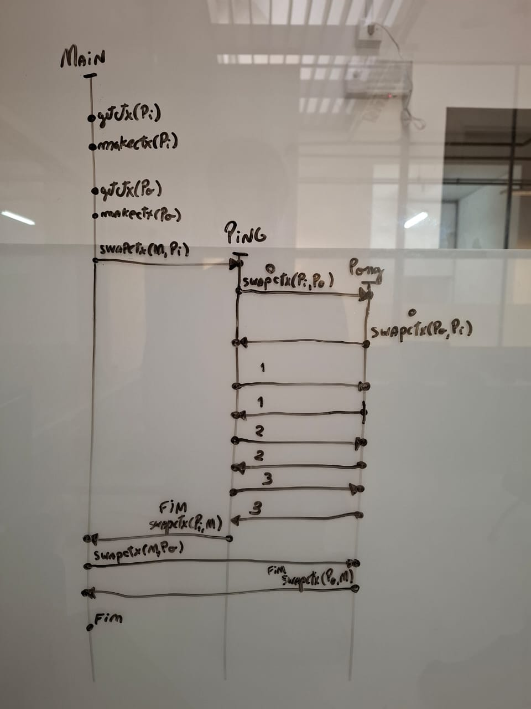

# Relatório

## 1. Explique o objetivo e os parâmetros de cada uma das quatro funções acima.

`getcontext(&a)`: Salva o contexto atual na variável `a`.
`setcontext(&a)`: Restaura o contexto que estava salvo na variável `a`.
`swapcontext(&a,&b)`: Salva o contexto atual em `a` e restaura o contexto salvo em `b`. É como se fosse um `getcontext(&a)` em sequência um `setcontext(&b)`.
`makecontext(&a,...)`: Ajusta valores internos do contexto salvo em `a`.

## 2.Explique o significado dos campos da estrutura ucontext_t que foram utilizados no código.

Esses `ucontext_t` são contextos que salvam algum "cenário" de execução, nesse caso, é salvo um cenário Ping e Pong que são incrementais quando estão em execução e um Main que está sendo utilizado como um contexto auxiliar, que salva o contexto atual para uma mudança.

## 3.Explique cada linha do código de contexts.c que chame uma dessas funções ou que manipule estruturas do tipo ucontext_t.

getcontext (&ContextPing) ; // Salva o contexto atual da execução na variável ContextPing
makecontext (&ContextPing, (void*)(*BodyPing), 1, "    Ping") ; // Ajusta o ContextPing para executar a função BodyPing com o parâmetro "   Ping" quando inicializado. 1 é a quantidade de argumentos de BodyPing
getcontext (&ContextPong) ; // Salva o contexto atual em ContextPong
makecontext (&ContextPong, (void*)(*BodyPong), 1, "        Pong") ; // Ajusta o ContextPong com a função BodyPong com parâmetro "     Pong"
...

## 4.Para visualizar melhor as trocas de contexto, desenhe o diagrama de tempo dessa execução.

